# 1740QCA Cian Davenhill
<h3>Process Journal — Fundamentals of Moving Image</h3>

<a href="#task-01">Task 01</a> &nbsp;·&nbsp; <a href="#task-02">Task 02</a> &nbsp;·&nbsp; <a href="#task-03">Task 03</a> &nbsp;·&nbsp; <a href="#task-04">Task 04</a> &nbsp;·&nbsp; <a href="#task-05">Task 05</a> &nbsp;·&nbsp; <a href="#task-06">Task 06</a> &nbsp;·&nbsp; <a href="#assignment-02">Assignment 02</a>

---

## Task 01: Image Database Creation

Before any capturing or editing began, I built a structured file directory to keep RAW captures, working PSDs, and exports separate and traceable throughout the project. Keeping this consistent from week one meant every later task — Lightroom catalogues, Photoshop exports, After Effects source folders — could reference a predictable location.

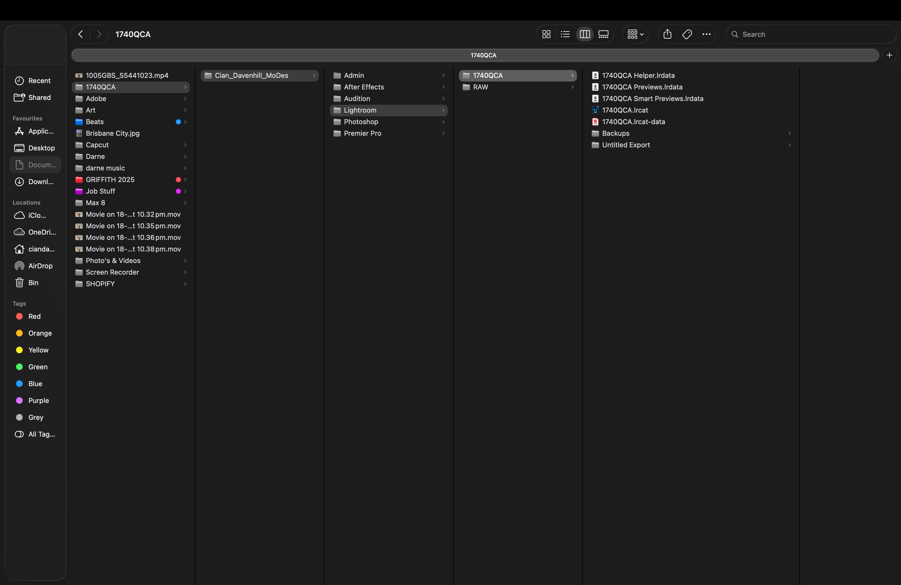
*Correctly named sub-folder structure separating RAW captures, PSD working files, and final exports — the foundation for every task that follows.*

---

## Task 02: Capture, Import, Edit & Export

This task focused on getting comfortable with a full RAW workflow: capturing, cataloguing, and non-destructively editing images in Lightroom Classic before exporting them for use in Photoshop.

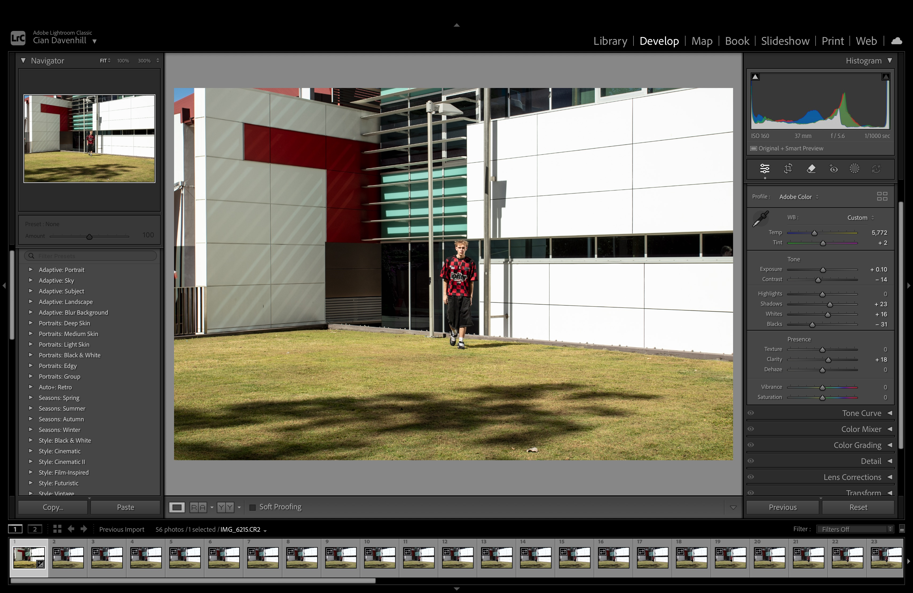
*Develop module showing experimentation with exposure, contrast, white balance, and tone curve adjustments on a RAW capture.*

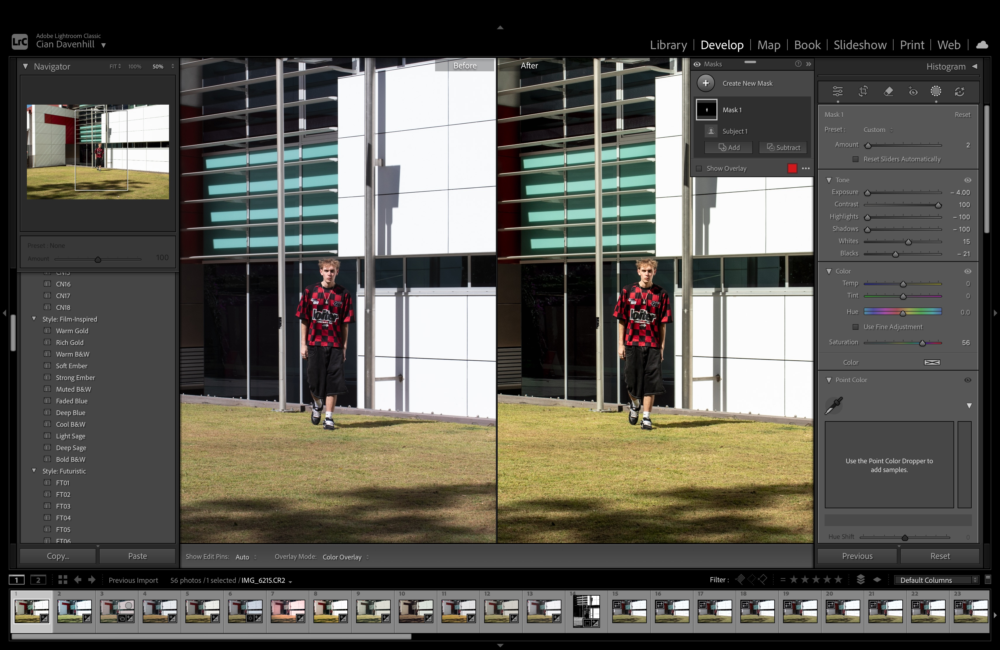
*Before and after comparison — pushed the HSL panel (targeting specific hue ranges), added clarity, and applied a custom user preset to establish a consistent look across the sequence.*

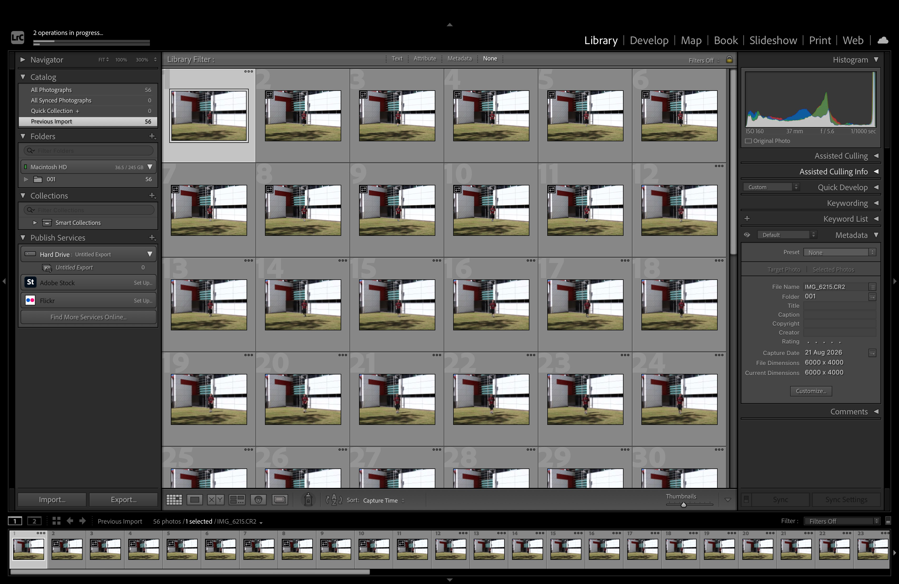
*Completed Lightroom Classic catalogue file, along with a back-up catalogue, ensuring the image database remained recoverable and intact.*

---

## Task 03: The Composite Image

For this task I moved into Photoshop's Layers panel to build a set of composite images, deliberately varying my approach across each one — different mask types, blend modes, and adjustment layer combinations — rather than repeating a single technique.

<h3 class="composite-title">Composite 1 — Gradient Blend with Vivid Light</h3>
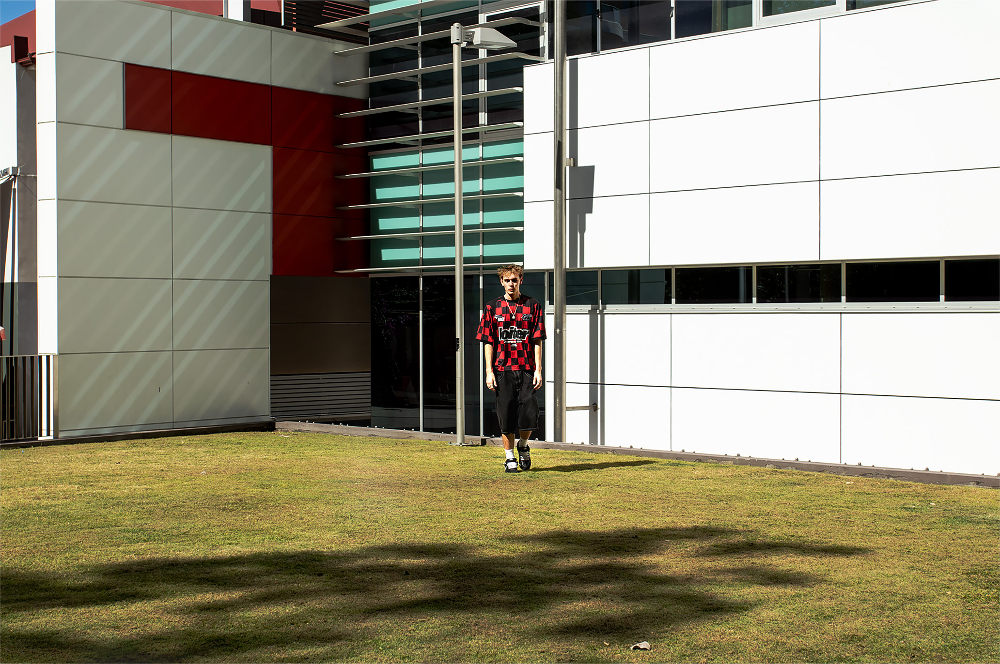
*Built by grouping a base layer with a second exposure, blended using a gradient layer mask and set to Vivid Light for a high-contrast, punchy result. A clipped Curves adjustment layer targeted local contrast, while an unclipped Hue/Saturation layer unified the colour grade across the whole composite.*

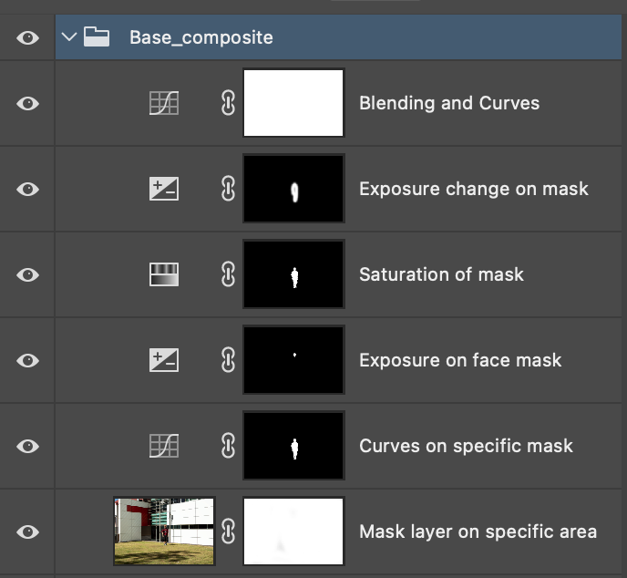
*Layers panel showing the grouped composite structure: gradient mask, Vivid Light blend mode, a clipped Curves adjustment, and a global Hue/Saturation pass sitting above the group.*

<h3 class="composite-title">Composite 2 — Black & White with Film Grain</h3>
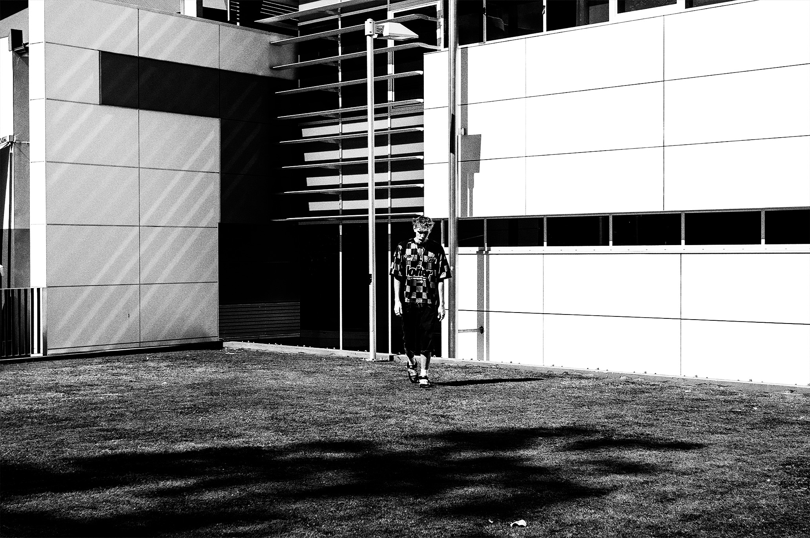
*Converted using a Black & White adjustment layer with channel-specific tonal control (rather than a flat desaturation), boosted with a Curves S-curve for contrast. Film grain was added via a 50%-grey Overlay layer with monochromatic noise applied, and a soft elliptical vignette mask was used to draw focus toward the centre of the frame.*

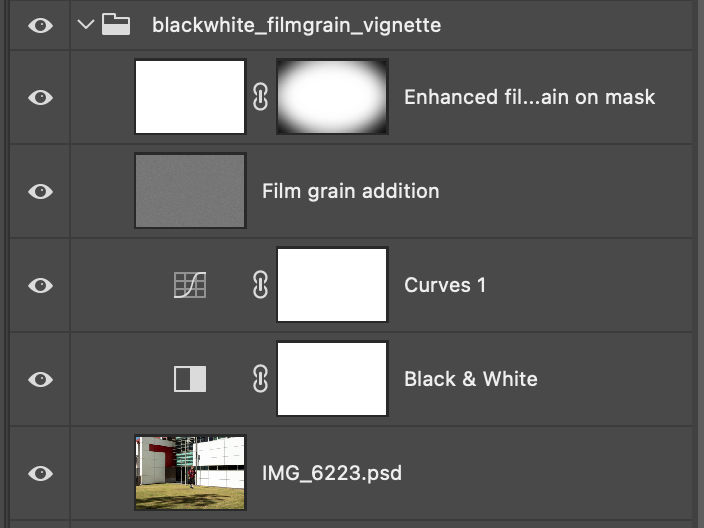
*Layers panel showing the Black & White and Curves adjustment layers, the grain layer set to Overlay, and the inverted, feathered vignette mask.*

<h3 class="composite-title">Composite 3 — Ghosting / Double Exposure</h3>
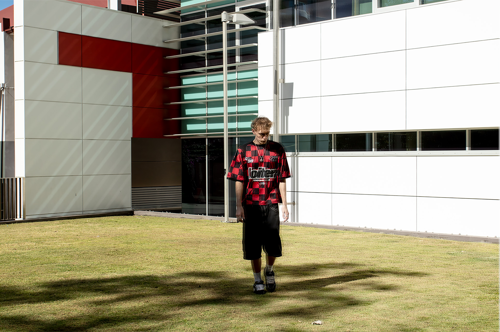
*Created by duplicating the base layer, setting the duplicate to Screen blend mode, and offsetting it slightly to produce a soft double-exposure "echo." A gradient mask controlled where the ghosting effect appeared, fading it into the sky rather than applying it evenly across the frame, and layer opacity was reduced to keep the effect atmospheric rather than overpowering.*

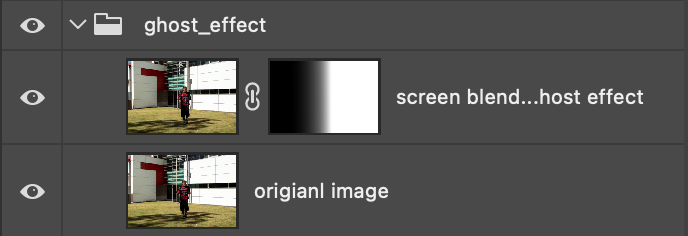
*Layers panel showing the duplicated and offset layer, Screen blend mode, gradient mask, and opacity adjustment.*

<h3 class="composite-title">Composite 4 — Split-Tone Cinematic Grade</h3>
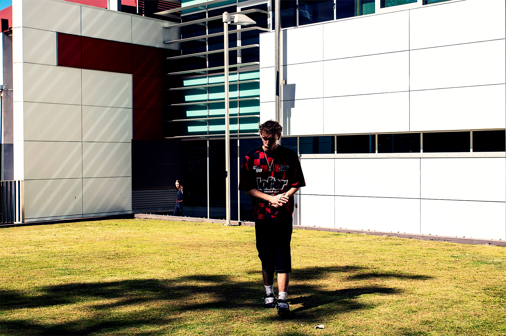
*Built entirely through adjustment layers rather than masking: a base Curves S-curve for contrast, followed by two separate Color Balance layers — one targeting shadows (pushed toward cyan/blue) and one targeting highlights (pushed toward red/yellow) — to produce a teal-and-orange cinematic look.*

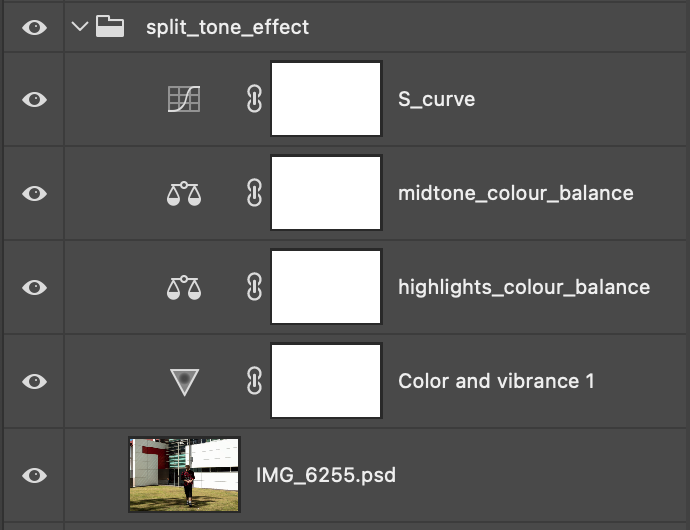
*Layers panel showing the Curves layer and the two independently targeted Color Balance adjustment layers, grouped as "Cinematic_split_tone."*

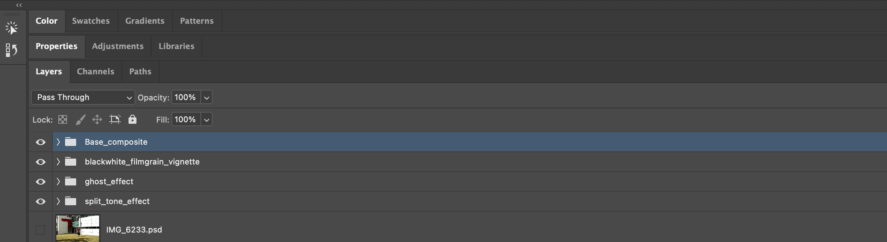
*Grouped layer structure across the composite set, showing each composite organised into its own named group for clarity.*

---

## Task 04: The GIF — Looping Moving Image

Rather than animating a fresh photo sequence, I used my Task 03 composite file directly: toggling layer visibility, masks, and blend modes between frames in Photoshop's Timeline panel to create a shifting, glitch-like portrait animation — reinforcing the same layer techniques from Task 03 in a temporal context.

<h3 class="composite-title">GIF 1 — Fast, flickering rhythm</h3>
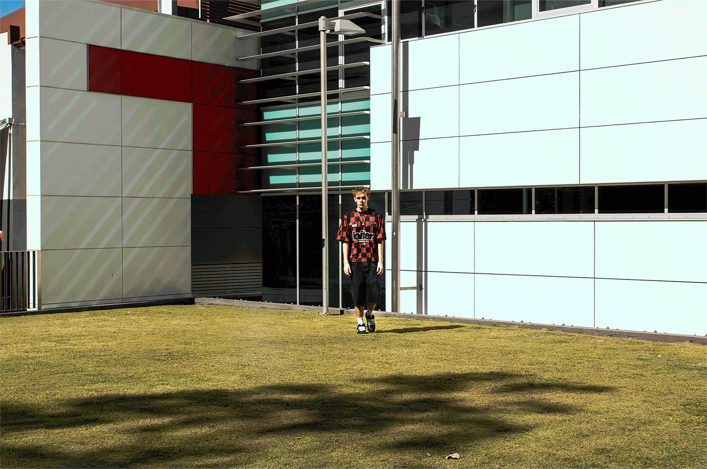
*Short frame duration with no tweening, toggling mask and blend mode visibility between frames for a fast, stuttering, flicker-like effect.*

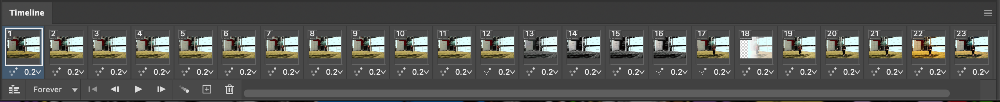
*Timeline panel showing frame durations for GIF 1.*

<h3 class="composite-title">GIF 2 — Slow, dissolving rhythm</h3>
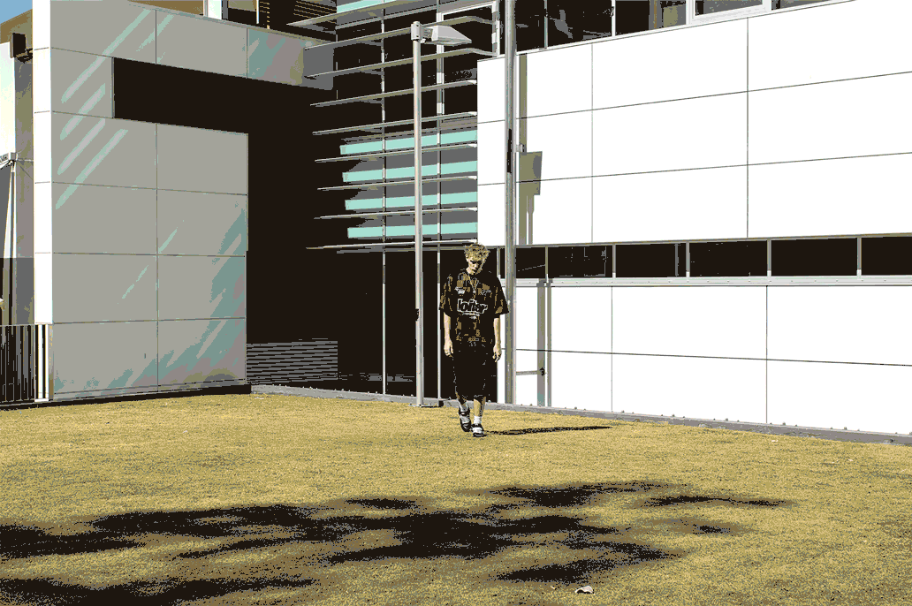
*Longer frame duration with tweening applied between key frames, letting Photoshop interpolate position and opacity for a smoother, dreamier transition between layer states.*

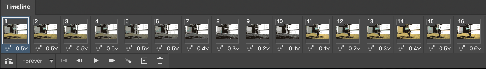
*Timeline panel showing frame durations and tweening for GIF 2.*

<h3 class="composite-title">GIF 3 — Looping variation</h3>
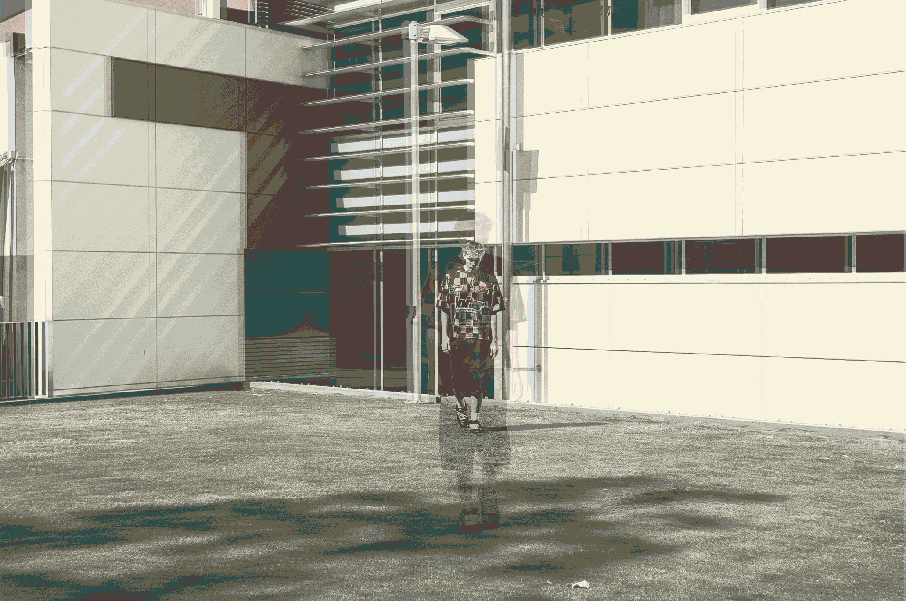
*A third pass using Forever looping with a mixed duration pattern across frames, to compare pacing and rhythm side-by-side with GIFs 1 and 2.*

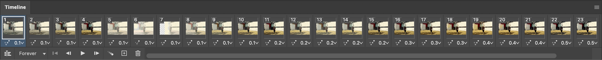
*Timeline panel showing frame durations for GIF 3.*

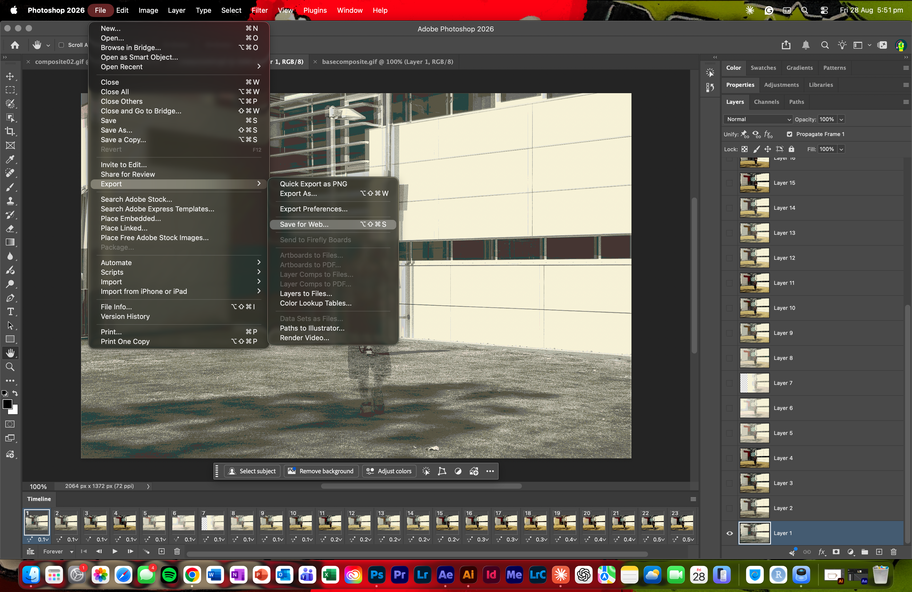
*File > Export > Save for Web (Legacy) — the export workflow used to generate each GIF from the Timeline animation.*

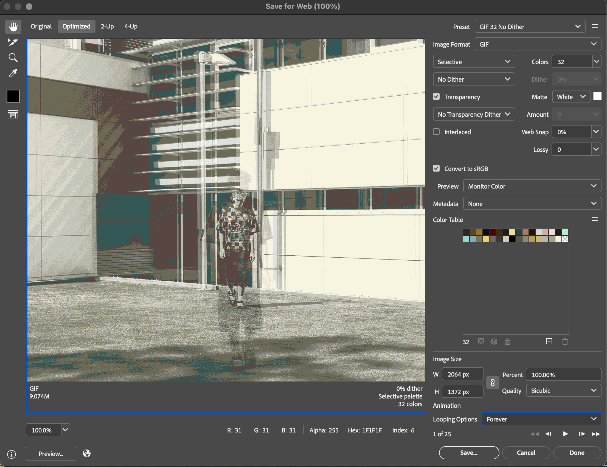
*Export parameters showing colour palette and dithering settings — experimented with different colour counts across GIFs to balance visual quality against file size.*

---

## Task 05: Image Sequences in After Effects

For this task I built a stop-motion image sequence, imported it into After Effects as individual layers (not a single merged sequence, so each frame remained independently editable), and produced six compositions from the same source material — each varying still duration, layer overlap, and transition type to explore how temporal pacing changes the feel of the same footage.

<h3 class="composite-title">Composition 1 — Baseline, no transition</h3>
<iframe width="560" height="315" src="https://www.youtube.com/embed/6K16VSv3Svs" title="YouTube video player" frameborder="0" allowfullscreen></iframe>

*Still duration of 4 frames per image, no overlap, no transition — a straightforward, evenly-paced cut between stills as a baseline for comparison.*

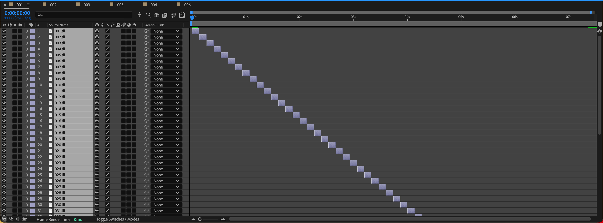
*Timeline panel showing sequenced layers, alongside the corresponding frame in the Composition panel.*

<h3 class="composite-title">Composition 2 — Dissolve transition, short overlap</h3>
<iframe width="560" height="315" src="https://www.youtube.com/embed/04uyCBwDiLk" title="YouTube video player" frameborder="0" allowfullscreen></iframe>

*Still duration of 4 frames, 2-frame overlap using the Dissolve Front Layer transition — softening the cut between stills without fully blending them.*

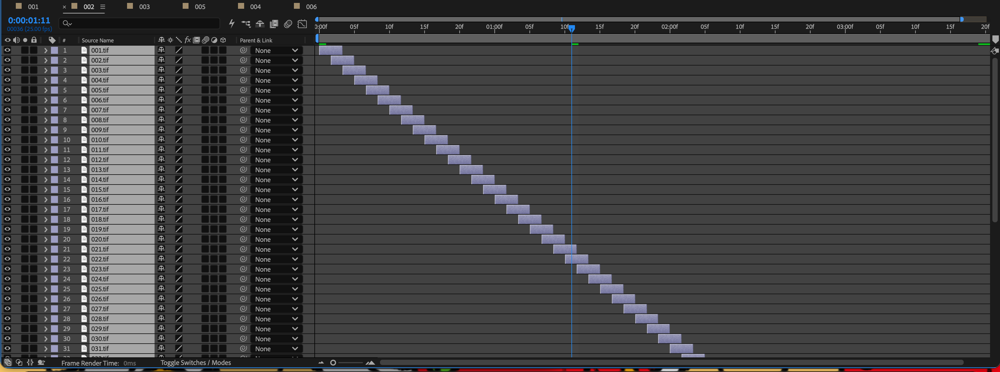
*Timeline panel showing overlap keyframes for Composition 2.*

<h3 class="composite-title">Composition 3 — Longer hold, deeper dissolve</h3>
<iframe width="560" height="315" src="https://www.youtube.com/embed/Z-yINb7g2ZI" title="YouTube video player" frameborder="0" allowfullscreen></iframe>

*Still duration extended to 8 frames with a 4-frame overlap, still using Dissolve Front Layer — a noticeably slower, more deliberate pace than Composition 2.*

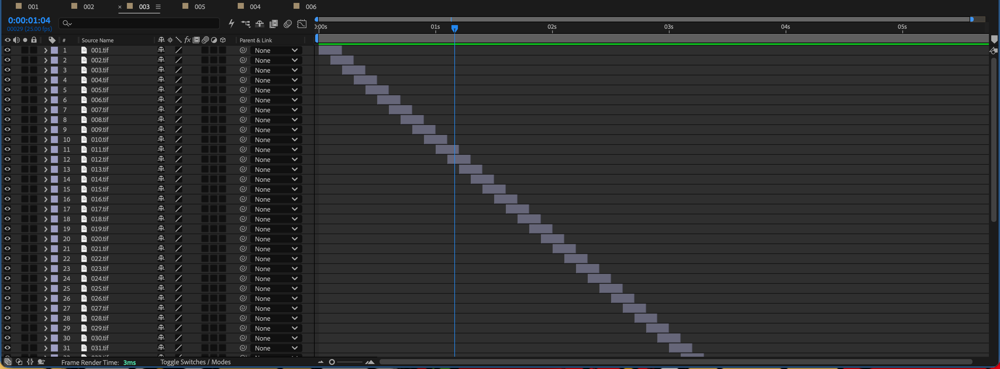
*Timeline panel showing the longer still duration and overlap for Composition 3.*

<h3 class="composite-title">Composition 4 — Fast, punchy pacing</h3>
<iframe width="560" height="315" src="https://www.youtube.com/embed/3_dtzHl7moM" title="YouTube video player" frameborder="0" allowfullscreen></iframe>

*Still duration reduced to 2 frames, no overlap, no transition — the fastest-paced composition in the set, producing a rapid, almost frantic stop-motion rhythm at the opposite extreme to Composition 3.*

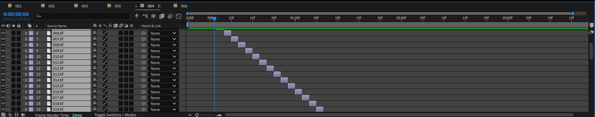
*Timeline panel showing the short still duration for Composition 4.*

<h3 class="composite-title">Composition 5 — Slow, blended dissolve</h3>
<iframe width="560" height="315" src="https://www.youtube.com/embed/wPIGt-Ld6kU" title="YouTube video player" frameborder="0" allowfullscreen></iframe>

*Still duration of 12 frames with an 8-frame overlap, using Cross Dissolve Front and Back Layers so both outgoing and incoming stills blend together — the slowest and most atmospheric composition of the five.*

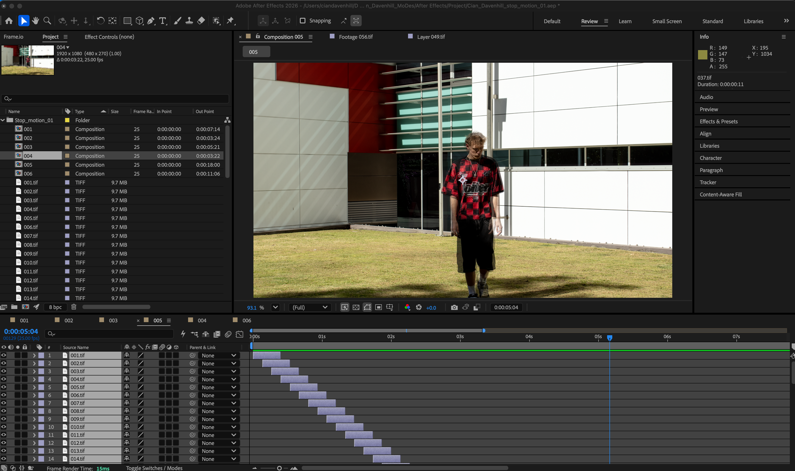
*Timeline panel showing the extended overlap and Cross Dissolve transition for Composition 5.*

<h3 class="composite-title">Composition 6 — Manual keyframe animation</h3>
<iframe width="560" height="315" src="https://www.youtube.com/embed/StoHVctIs_I" title="YouTube video player" frameborder="0" allowfullscreen></iframe>

*Rather than relying on the automated composition settings, this version was built by manually keyframing Scale and Position on individual layers within the Timeline — subtly zooming and shifting each still during its hold, producing a "living stills" drift rather than static frames. This demonstrates direct keyframe control beyond the New Composition from Selection dialog used in Compositions 1–5.*

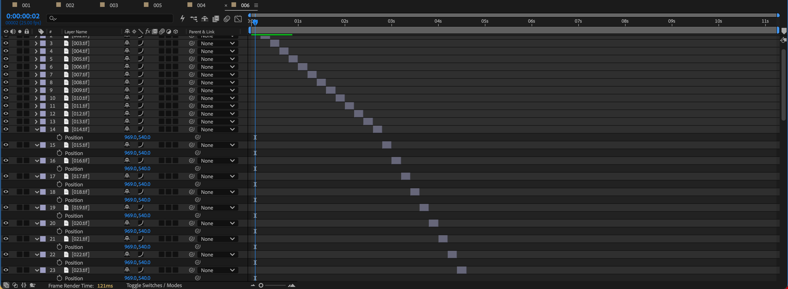
*Timeline panel showing manually placed Scale and Position keyframes for Composition 6.*

---

## Task 06: Reflective Report

Working through this assignment gave me a much clearer understanding of non-destructive editing as a genuine workflow, not just a checklist of Photoshop tools. Building four composites forced me to think about which technique actually suited each image rather than defaulting to one method — I learned that a gradient mask reads very differently to a hand-painted brush mask, and that clipped adjustment layers (like Curves) behave completely differently to unclipped ones sitting above a whole composite.

A genuine challenge came early: my Quick Selection masks kept producing harsh, obviously artificial edges that undermined the blend rather than supporting it. Rather than forcing the technique to work, I switched to gradient and brush masking for the composites where blending needed to look intentional, and used Quick Selection only where a precise edge was actually the goal. That decision — and troubleshooting smaller issues like a hidden layer blocking the Brush tool — taught me that technique choice depends on the image's tonal structure and intent, not just the desired outcome.

Task 04 reinforced the same layer thinking temporally: toggling masks, blend modes, and visibility between frames in the Timeline panel showed me how spatial edits (Task 03) and temporal edits (Task 04) are really the same skill applied on a different axis.

After Effects extended this further. Producing six compositions from one stop-motion sequence — varying still duration, overlap, and transition type, then pushing into manual Scale and Position keyframing — clarified how temporal rhythm is a deliberate design choice, not a default setting. Comparing a 2-frame still duration against a 12-frame overlap with Cross Dissolve made the emotional effect of pacing immediately obvious in a way reading about it never would have.

If I continued this project, I would explore Time Remapping and speed ramping more deliberately, since my current pacing control relies on discrete stills rather than true continuous motion manipulation. Overall, this assignment shifted my understanding of motion design from a set of separate tools toward a single continuum of spatial and temporal control.

---

## Assignment 02: Motion Graphic Design

<a href="#a02-task-01">Task 01</a> &nbsp;·&nbsp; <a href="#a02-task-02">Task 02</a> &nbsp;·&nbsp; <a href="#a02-task-03">Task 03</a> &nbsp;·&nbsp; <a href="#a02-task-04">Task 04</a>

For this assignment I developed a kinetic typography concept inspired by Junya Watanabe's poem and slogan garments — particularly the repeated, overlapping, multi-coloured phrase treatment seen across his archive pieces. Using the phrase *"Life itself is the immortal state of love, the supreme virtue of all virtues when acquired it is more important than"*, I built a layered, staggered text animation in 2D, then extended it into 3D space with depth, lighting, and camera movement.

<h3 class="composite-title">Exemplar Research</h3>
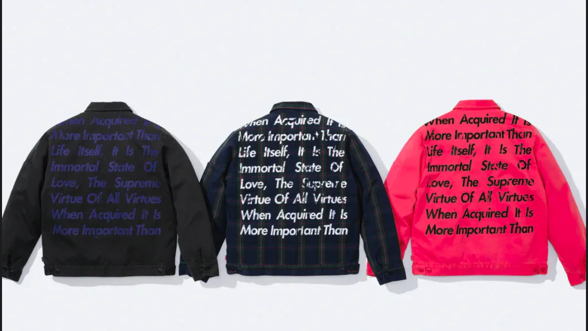
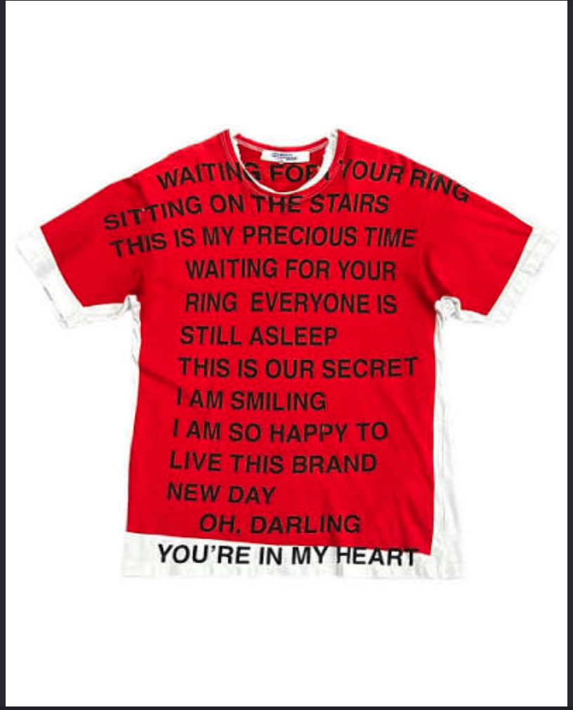
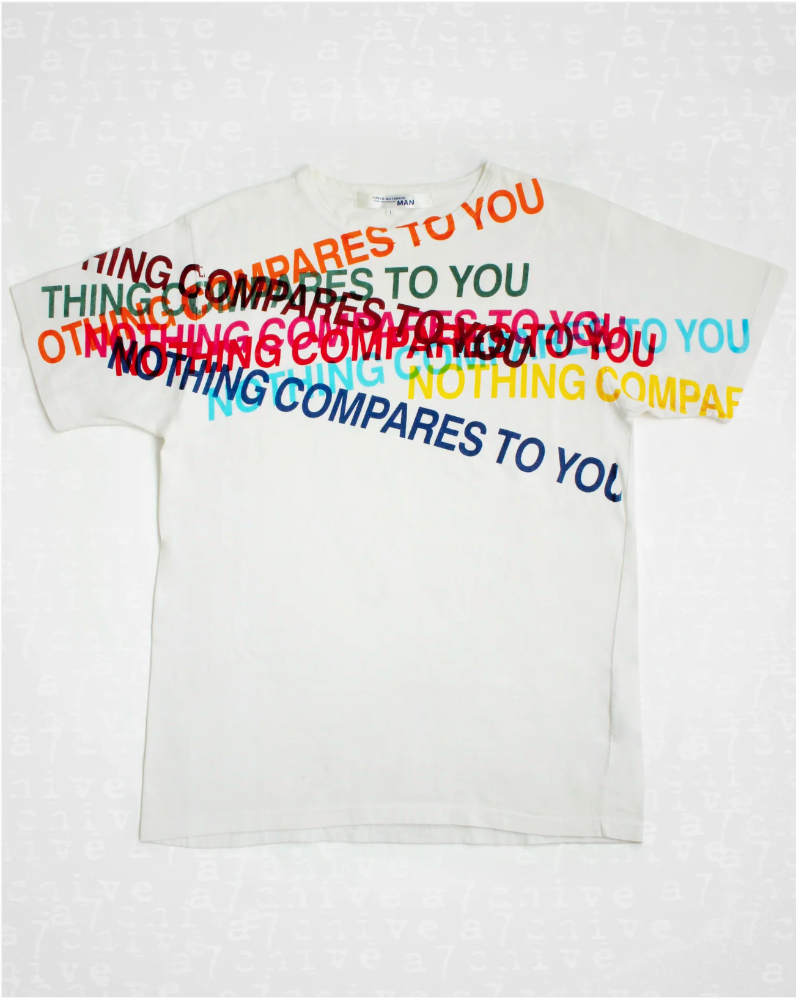
*Reference garments by Junya Watanabe — the layered, overlapping, multi-coloured repeated phrase treatment across the sleeve of the white t-shirt directly informed the staggered colour-duplicate technique used throughout Task 01 and 02.*

---

<h3 class="composite-title">Task 01: Animating 2D Text</h3>

Working from the Watanabe reference, I duplicated the phrase across multiple text layers, each in a different colour, with slight rotation and position offsets to recreate the layered, scattered effect from the garment. Entrances were staggered and synced to an audio track using waveform markers.

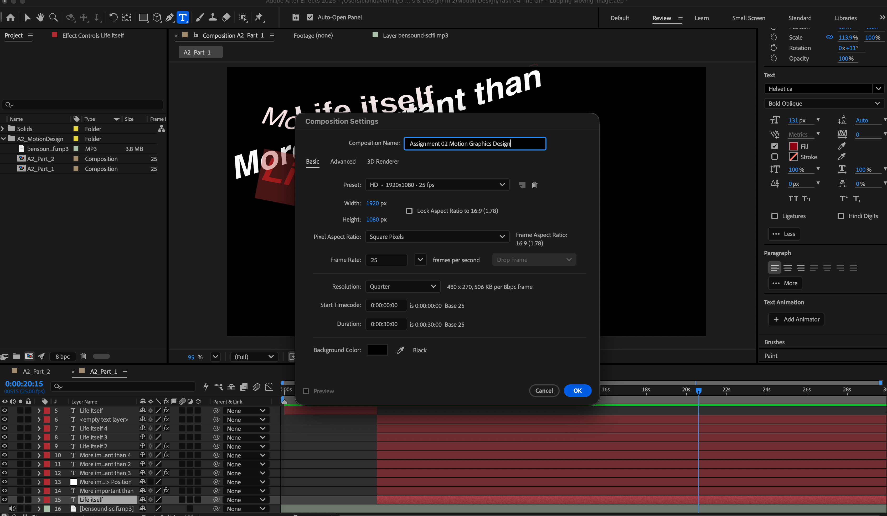
*HD composition set to 1920x1080 at 25fps.*

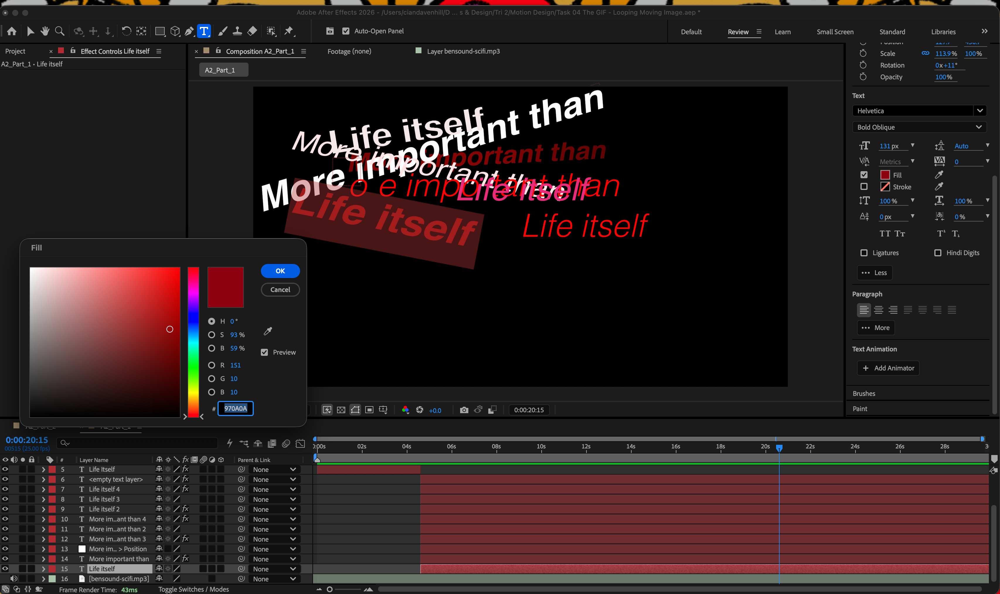
*Text panel showing font, colour, and kerning adjustments applied across the duplicated phrase layers.*

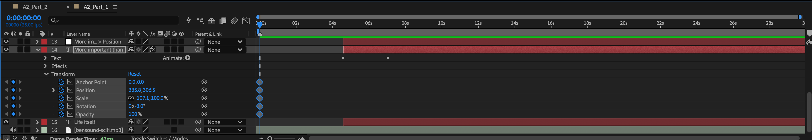
*Position, Rotation, and Scale keyframed individually on each staggered colour duplicate to build the layered, offset composition.*

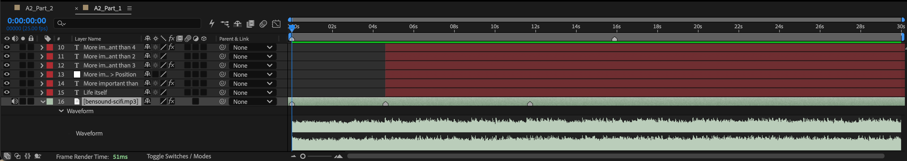
*Audio waveform with markers placed at key beats, used to cue each colour layer's entrance in sync with the track's rhythm.*

<video controls width="100%">
  <source src="A2_Part_1.mp4" type="video/mp4">
</video>
*Final Task 01 composition — layered, staggered 2D kinetic type synced to audio.*

---

<h3 class="composite-title">Task 02: Working with 3D Text</h3>

Building on the same phrase and colour-duplicate structure from Task 01, I extended the concept into 3D space — staggering the layers in genuine depth (Z-position) rather than just 2D offset, and adding a camera push-through move to reveal the layering spatially.

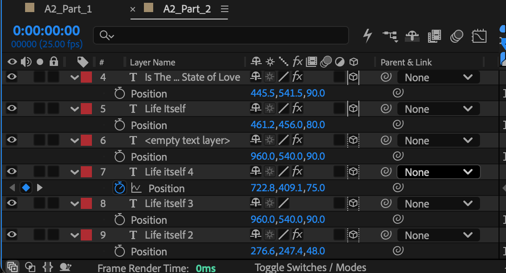
*Z-position keyframed across each colour layer to stagger them spatially, giving the overlapping phrases genuine depth rather than flat 2D offset.*

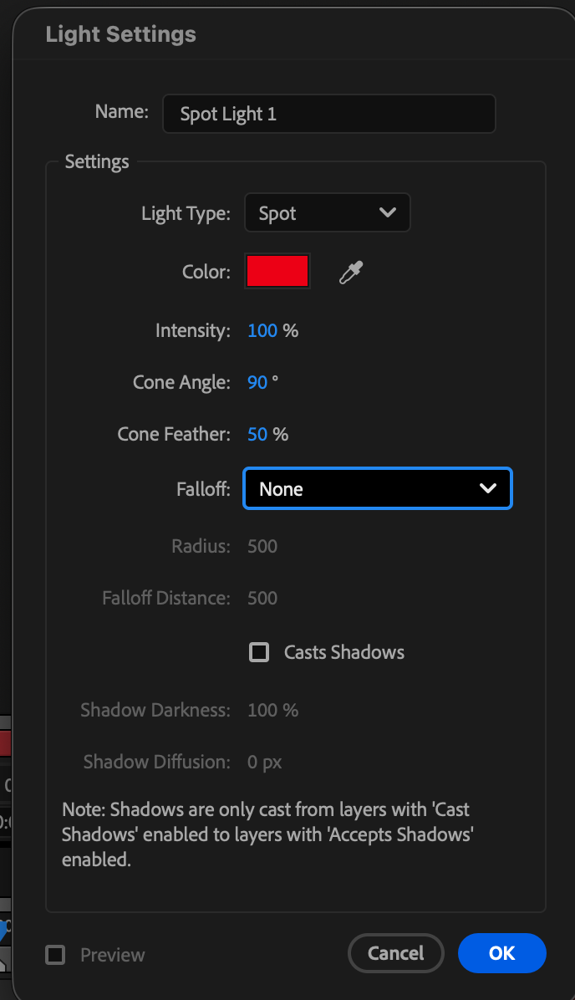
*Spotlight added and positioned to rake across the staggered 3D text, revealing the extrusion and bevel through highlight and shadow.*

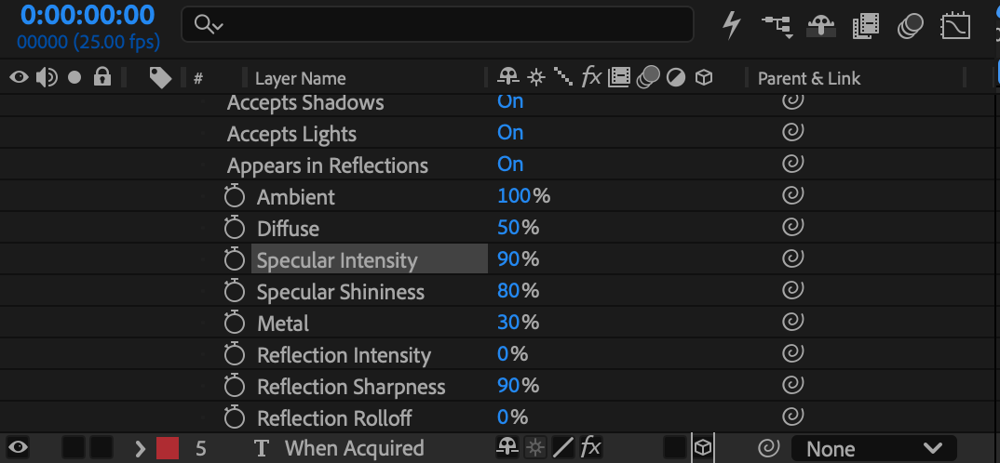
*Specular Intensity and Shininess adjusted per layer so light reflects differently across each colour duplicate.*

<video controls width="100%">
  <source src="A2_Part_2.mp4" type="video/mp4">
</video>
*Final Task 02 composition — 3D extruded, lit, and camera-animated version of the layered text concept.*

---

<h3 class="composite-title">Task 03: Refining, Timing, and Compositing</h3>

Task 01 and Task 02 were combined into a single sequenced composite, cross-fading from the 2D layered version into the 3D extruded version. During this process I encountered a frame rate mismatch between the two source compositions, which caused the audio and animation to desynchronise and slow noticeably midway through the sequence — resolved by rebuilding the composite from my rendered exports rather than nested live compositions.

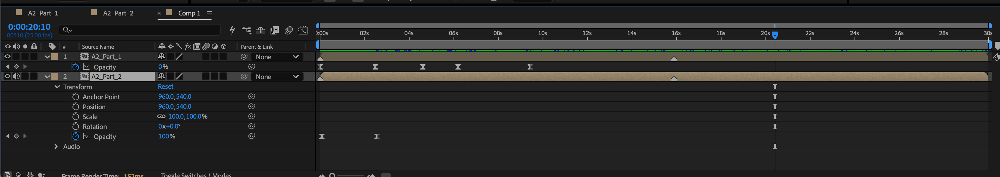
*Task 01 and Task 02 sequenced together in a new composite, with a cross-fade transition between them.*

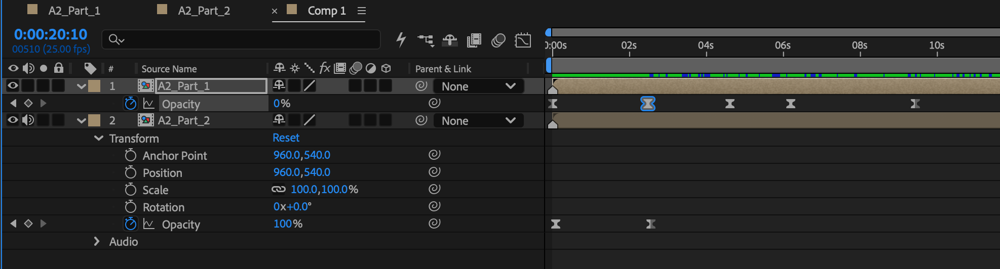
*Opacity keyframes used to create the cross-fade transition between the two sequences, synchronised against the shared audio track.*

<video controls width="100%">
  <source src="Comp 1.mp4" type="video/mp4">
</video>
*Final refined Task 03 composite — combining the 2D and 3D kinetic text sequences into one finished, synchronised motion design piece.*

---

<h3 class="composite-title">Audio Attribution</h3>

*Licence terms for the royalty-free track used throughout Assignment 02, used under a free licence with attribution.*

---

<h3 class="composite-title">Task 04: Reflective Report</h3>

This assignment extended my kinetic typography practice into layered, spatial composition, using Junya Watanabe's overlapping poem and slogan garments as my exemplar — particularly the repeated, multi-coloured phrase treatment across his archive pieces. I chose the line "Life itself is the immortal state of love, the supreme virtue of all virtues when acquired it is more important than" for its cyclical structure, which suited a staggered, layered reveal rather than a single linear read.

In Task 01, I duplicated the phrase across multiple text layers, varying colour, rotation, and position to recreate Watanabe's scattered overlap, then staggered each layer's entrance using markers placed against the audio waveform. Task 02 extended this into three dimensions: rather than treating depth as decorative, I staggered each colour layer's Z-position individually, so the "layering" implied by the 2D overlap became a literal spatial structure. Animating the camera to push through this stack, combined with a Spotlight raking across the extruded bevels, let me test how virtual lighting and camera movement can make a flat design reference feel genuinely three-dimensional.

A significant technical challenge was a frame rate mismatch between my Task 01 and Task 02 compositions, which caused audio and animation to desynchronise and slow midway through my combined Task 03 sequence. Diagnosing this — checking each composition's frame rate individually rather than assuming they matched — taught me that compositing isn't just arranging finished pieces, but verifying their underlying technical parameters align. I resolved it by rebuilding the sequence from my rendered exports rather than nested live compositions.

Researching the neon flicker wiggle-expression technique for my glow effects was similarly self-directed, beyond what the task sheets covered, and reinforced how expressions can generate more convincing, less mechanical randomness than manual keyframing alone.

If I extended this project, I would explore more deliberate colour sequencing across the layers, since my current palette choices were closer to instinctive than systematic, and I'd like to test whether syncing extrusion depth itself to the audio's rhythm could reinforce the spatial concept further.
