# 1740QCA Cian Davenhill
<h3>Process Journal — Fundamentals of Moving Image</h3>

<a href="#assignment-01">Assignment 01</a> &nbsp;·&nbsp; <a href="#assignment-02">Assignment 02</a> &nbsp;·&nbsp; <a href="#assignment-03">Assignment 03</a>

---

## Assignment 01: Image Editing and Animation

<a href="#task-01">Task 01</a> &nbsp;·&nbsp; <a href="#task-02">Task 02</a> &nbsp;·&nbsp; <a href="#task-03">Task 03</a> &nbsp;·&nbsp; <a href="#task-04">Task 04</a> &nbsp;·&nbsp; <a href="#task-05">Task 05</a> &nbsp;·&nbsp; <a href="#task-06">Task 06</a>

## Task 01: Image Database Creation

Before any capturing or editing began, I built a structured file directory to keep RAW captures, working PSDs, and exports separate and traceable throughout the project. Keeping this consistent from week one meant every later task — Lightroom catalogues, Photoshop exports, After Effects source folders — could reference a predictable location.

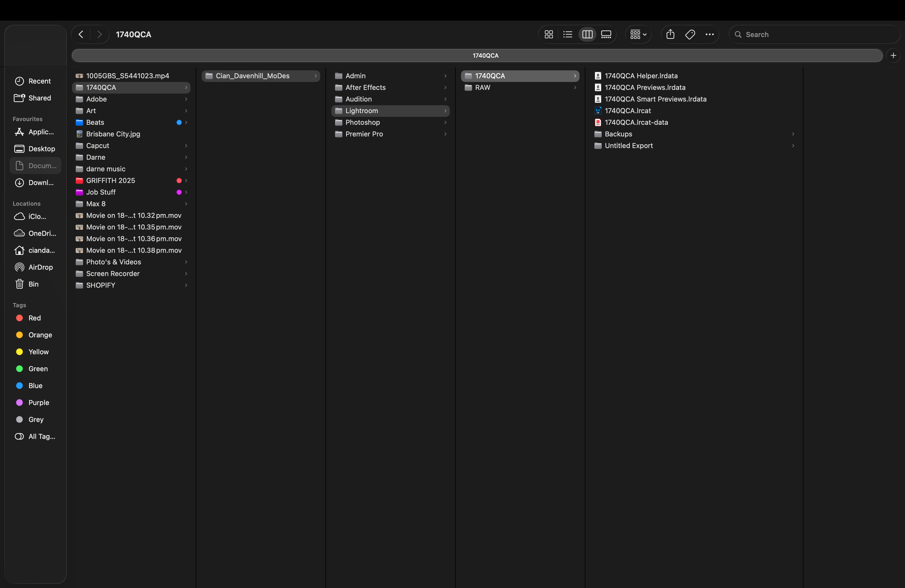
*Correctly named sub-folder structure separating RAW captures, PSD working files, and final exports — the foundation for every task that follows.*

---

## Task 02: Capture, Import, Edit & Export

This task focused on getting comfortable with a full RAW workflow: capturing, cataloguing, and non-destructively editing images in Lightroom Classic before exporting them for use in Photoshop.

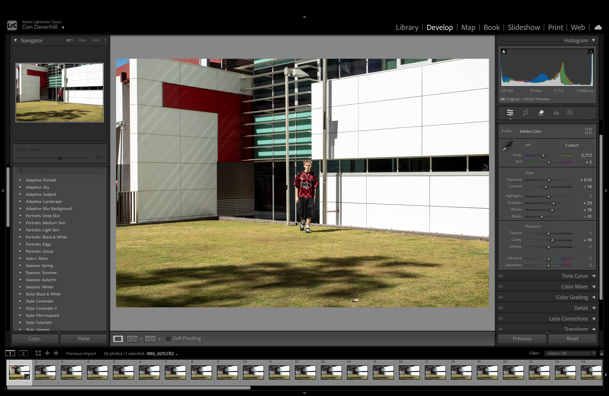
*Develop module showing experimentation with exposure, contrast, white balance, and tone curve adjustments on a RAW capture.*

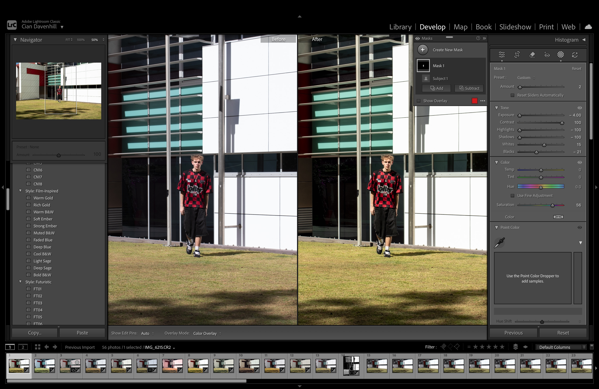
*Before and after comparison — pushed the HSL panel (targeting specific hue ranges), added clarity, and applied a custom user preset to establish a consistent look across the sequence.*

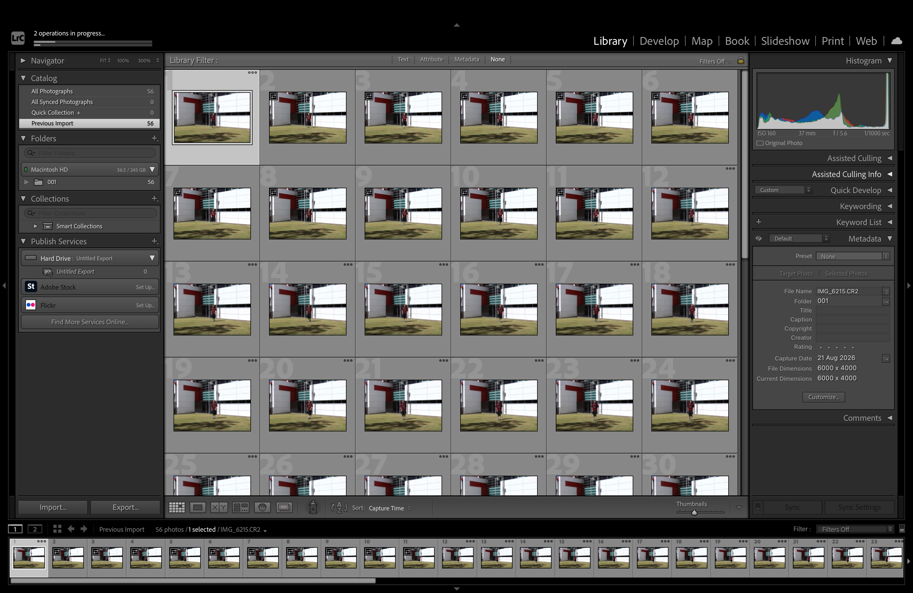
*Completed Lightroom Classic catalogue file, along with a back-up catalogue, ensuring the image database remained recoverable and intact.*

---

## Task 03: The Composite Image

For this task I moved into Photoshop's Layers panel to build a set of composite images, deliberately varying my approach across each one — different mask types, blend modes, and adjustment layer combinations — rather than repeating a single technique.

<h3 class="composite-title">Composite 1 — Gradient Blend with Vivid Light</h3>
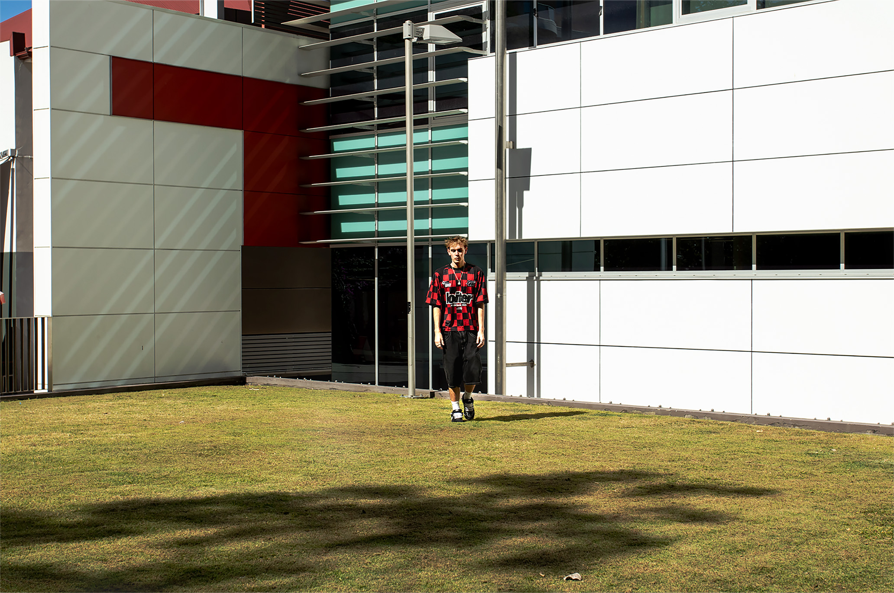
*Built by grouping a base layer with a second exposure, blended using a gradient layer mask and set to Vivid Light for a high-contrast, punchy result. A clipped Curves adjustment layer targeted local contrast, while an unclipped Hue/Saturation layer unified the colour grade across the whole composite.*

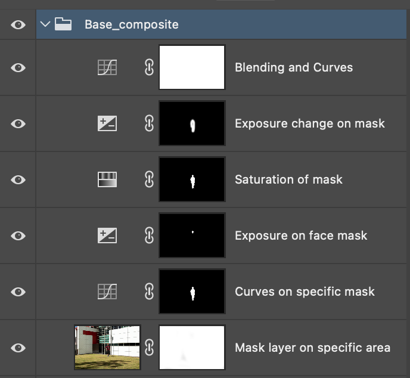
*Layers panel showing the grouped composite structure: gradient mask, Vivid Light blend mode, a clipped Curves adjustment, and a global Hue/Saturation pass sitting above the group.*

<h3 class="composite-title">Composite 2 — Black & White with Film Grain</h3>
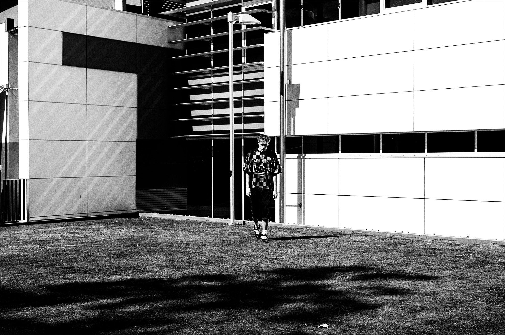
*Converted using a Black & White adjustment layer with channel-specific tonal control (rather than a flat desaturation), boosted with a Curves S-curve for contrast. Film grain was added via a 50%-grey Overlay layer with monochromatic noise applied, and a soft elliptical vignette mask was used to draw focus toward the centre of the frame.*

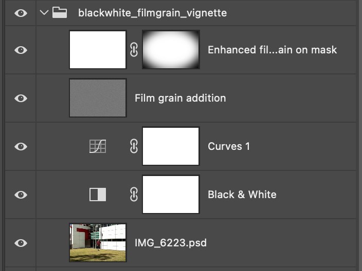
*Layers panel showing the Black & White and Curves adjustment layers, the grain layer set to Overlay, and the inverted, feathered vignette mask.*

<h3 class="composite-title">Composite 3 — Ghosting / Double Exposure</h3>
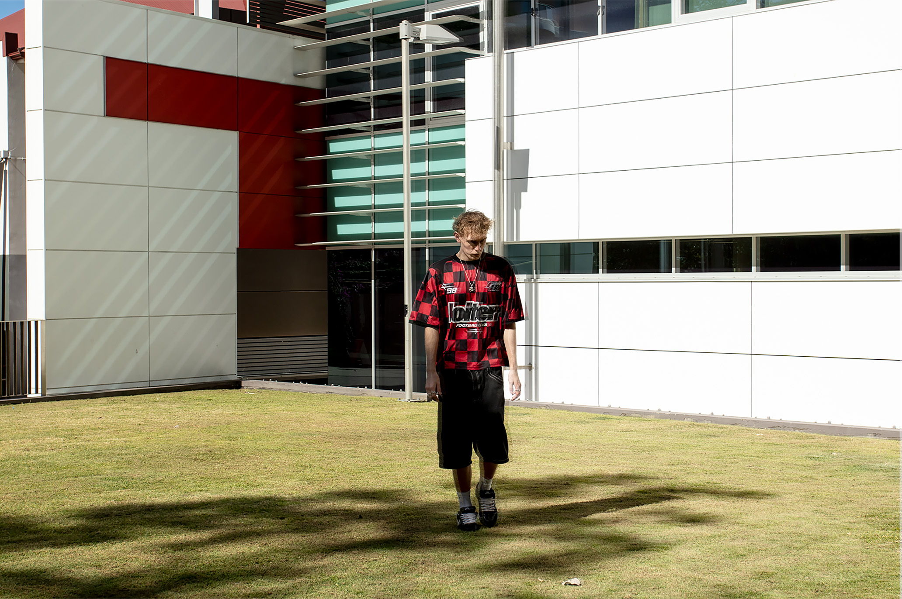
*Created by duplicating the base layer, setting the duplicate to Screen blend mode, and offsetting it slightly to produce a soft double-exposure "echo." A gradient mask controlled where the ghosting effect appeared, fading it into the sky rather than applying it evenly across the frame, and layer opacity was reduced to keep the effect atmospheric rather than overpowering.*

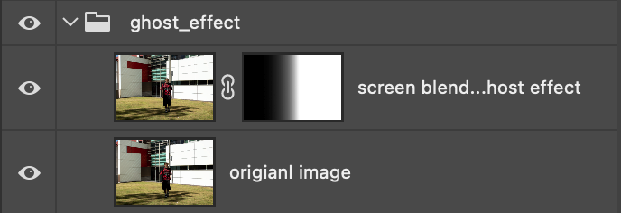
*Layers panel showing the duplicated and offset layer, Screen blend mode, gradient mask, and opacity adjustment.*

<h3 class="composite-title">Composite 4 — Split-Tone Cinematic Grade</h3>
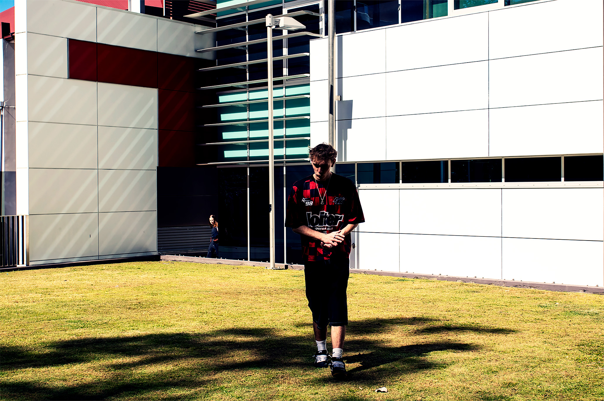
*Built entirely through adjustment layers rather than masking: a base Curves S-curve for contrast, followed by two separate Color Balance layers — one targeting shadows (pushed toward cyan/blue) and one targeting highlights (pushed toward red/yellow) — to produce a teal-and-orange cinematic look.*

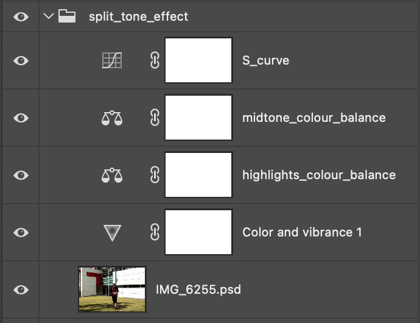
*Layers panel showing the Curves layer and the two independently targeted Color Balance adjustment layers, grouped as "Cinematic_split_tone."*

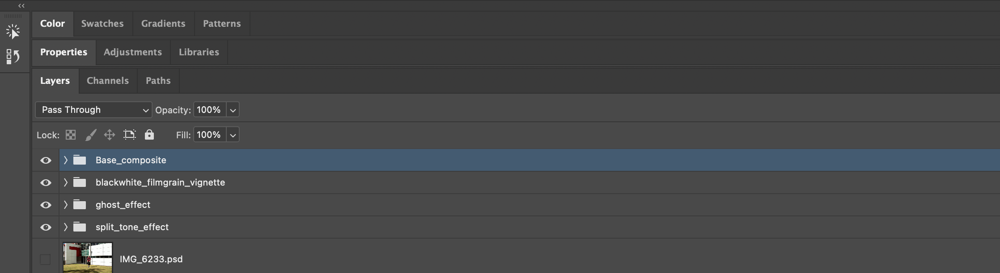
*Grouped layer structure across the composite set, showing each composite organised into its own named group for clarity.*

---

## Task 04: The GIF — Looping Moving Image

Rather than animating a fresh photo sequence, I used my Task 03 composite file directly: toggling layer visibility, masks, and blend modes between frames in Photoshop's Timeline panel to create a shifting, glitch-like portrait animation — reinforcing the same layer techniques from Task 03 in a temporal context.

<h3 class="composite-title">GIF 1 — Fast, flickering rhythm</h3>
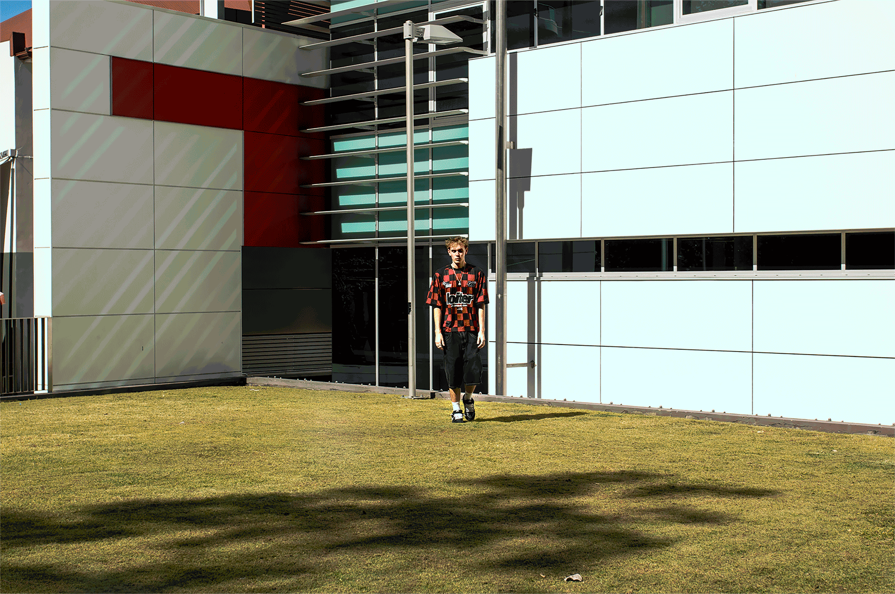
*Short frame duration with no tweening, toggling mask and blend mode visibility between frames for a fast, stuttering, flicker-like effect.*

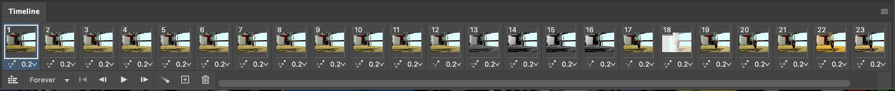
*Timeline panel showing frame durations for GIF 1.*

<h3 class="composite-title">GIF 2 — Slow, dissolving rhythm</h3>
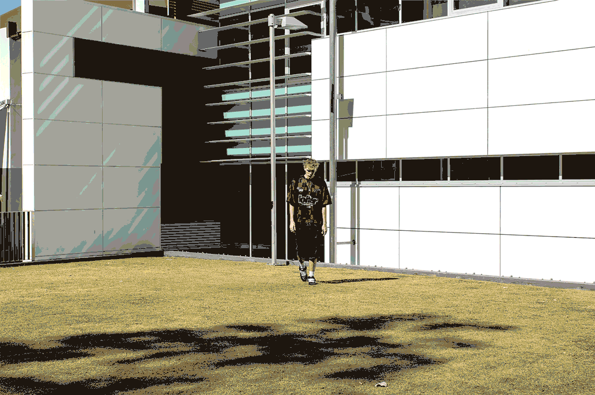
*Longer frame duration with tweening applied between key frames, letting Photoshop interpolate position and opacity for a smoother, dreamier transition between layer states.*

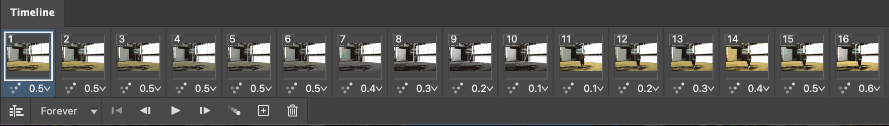
*Timeline panel showing frame durations and tweening for GIF 2.*

<h3 class="composite-title">GIF 3 — Looping variation</h3>
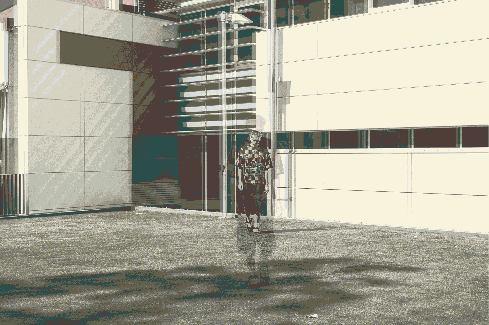
*A third pass using Forever looping with a mixed duration pattern across frames, to compare pacing and rhythm side-by-side with GIFs 1 and 2.*

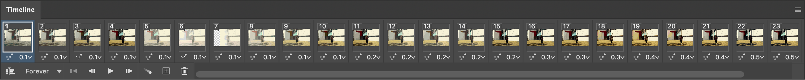
*Timeline panel showing frame durations for GIF 3.*

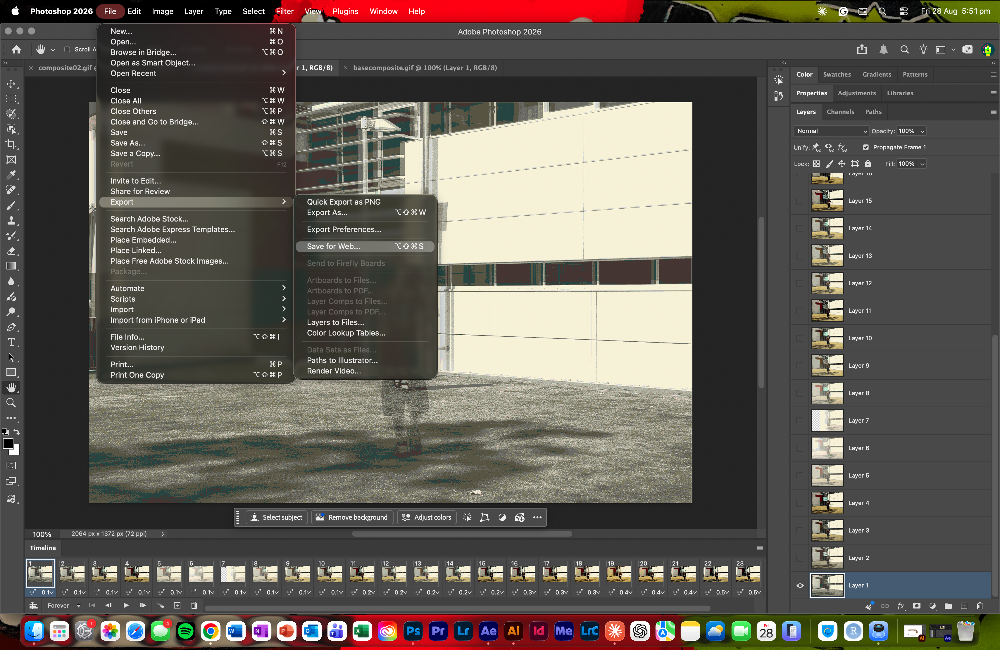
*File > Export > Save for Web (Legacy) — the export workflow used to generate each GIF from the Timeline animation.*

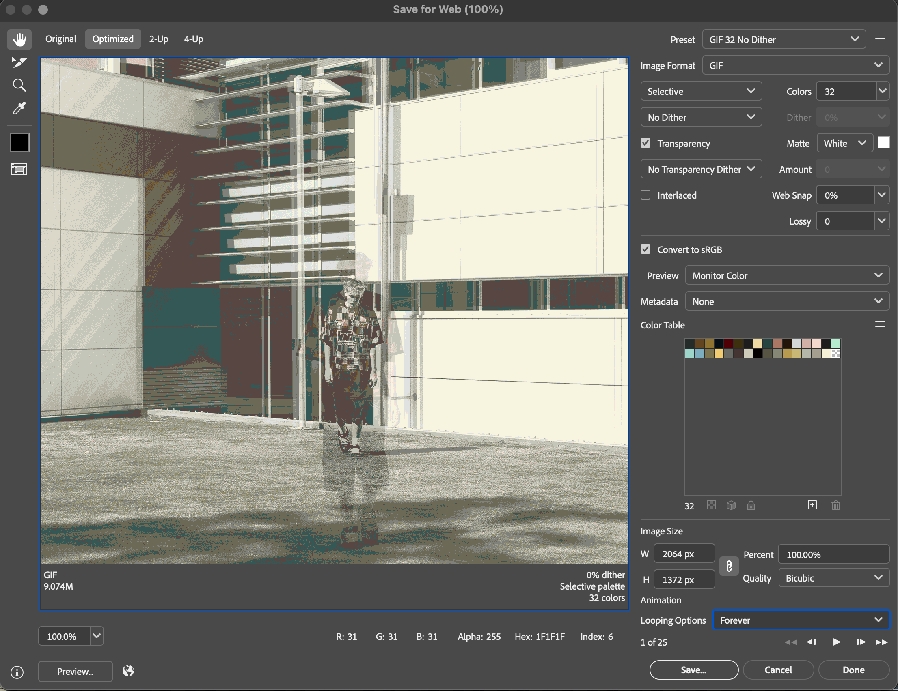
*Export parameters showing colour palette and dithering settings — experimented with different colour counts across GIFs to balance visual quality against file size.*

---

## Task 05: Image Sequences in After Effects

For this task I built a stop-motion image sequence, imported it into After Effects as individual layers (not a single merged sequence, so each frame remained independently editable), and produced six compositions from the same source material — each varying still duration, layer overlap, and transition type to explore how temporal pacing changes the feel of the same footage.

<h3 class="composite-title">Composition 1 — Baseline, no transition</h3>
<iframe width="560" height="315" src="https://www.youtube.com/embed/6K16VSv3Svs" title="YouTube video player" frameborder="0" allowfullscreen></iframe>

*Still duration of 4 frames per image, no overlap, no transition — a straightforward, evenly-paced cut between stills as a baseline for comparison.*

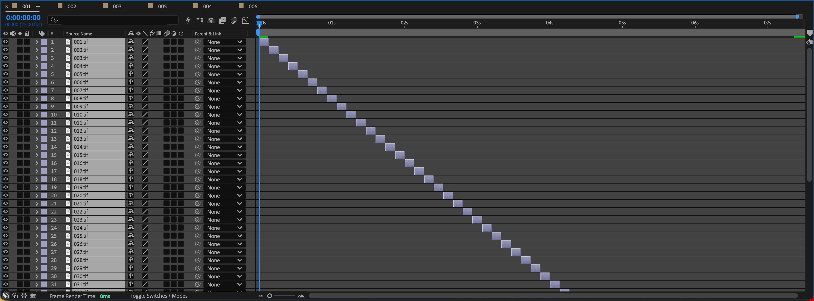
*Timeline panel showing sequenced layers, alongside the corresponding frame in the Composition panel.*

<h3 class="composite-title">Composition 2 — Dissolve transition, short overlap</h3>
<iframe width="560" height="315" src="https://www.youtube.com/embed/04uyCBwDiLk" title="YouTube video player" frameborder="0" allowfullscreen></iframe>

*Still duration of 4 frames, 2-frame overlap using the Dissolve Front Layer transition — softening the cut between stills without fully blending them.*

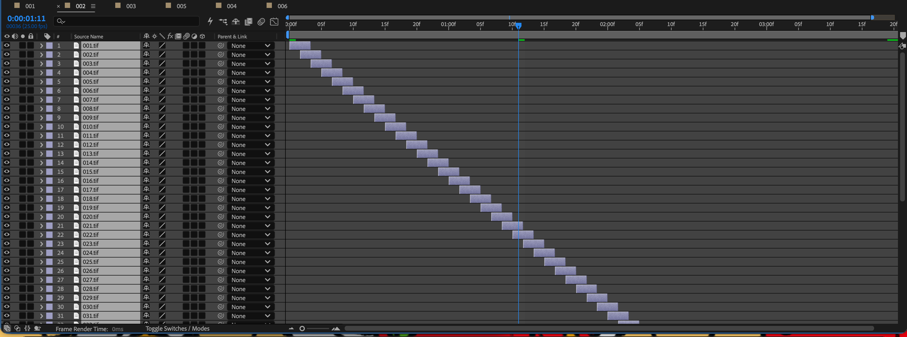
*Timeline panel showing overlap keyframes for Composition 2.*

<h3 class="composite-title">Composition 3 — Longer hold, deeper dissolve</h3>
<iframe width="560" height="315" src="https://www.youtube.com/embed/Z-yINb7g2ZI" title="YouTube video player" frameborder="0" allowfullscreen></iframe>

*Still duration extended to 8 frames with a 4-frame overlap, still using Dissolve Front Layer — a noticeably slower, more deliberate pace than Composition 2.*

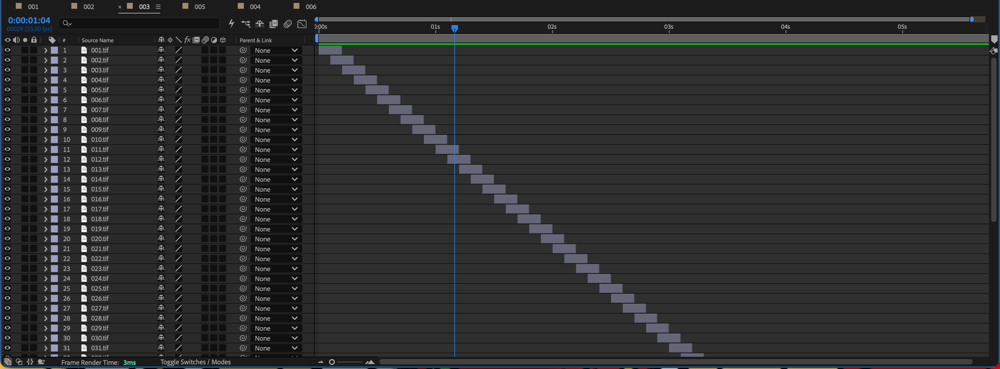
*Timeline panel showing the longer still duration and overlap for Composition 3.*

<h3 class="composite-title">Composition 4 — Fast, punchy pacing</h3>
<iframe width="560" height="315" src="https://www.youtube.com/embed/3_dtzHl7moM" title="YouTube video player" frameborder="0" allowfullscreen></iframe>

*Still duration reduced to 2 frames, no overlap, no transition — the fastest-paced composition in the set, producing a rapid, almost frantic stop-motion rhythm at the opposite extreme to Composition 3.*

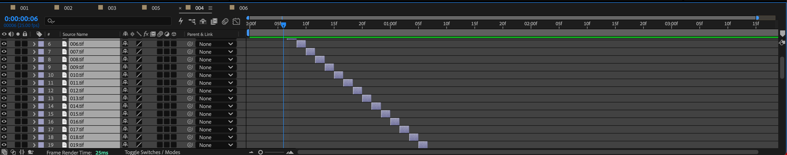
*Timeline panel showing the short still duration for Composition 4.*

<h3 class="composite-title">Composition 5 — Slow, blended dissolve</h3>
<iframe width="560" height="315" src="https://www.youtube.com/embed/wPIGt-Ld6kU" title="YouTube video player" frameborder="0" allowfullscreen></iframe>

*Still duration of 12 frames with an 8-frame overlap, using Cross Dissolve Front and Back Layers so both outgoing and incoming stills blend together — the slowest and most atmospheric composition of the five.*

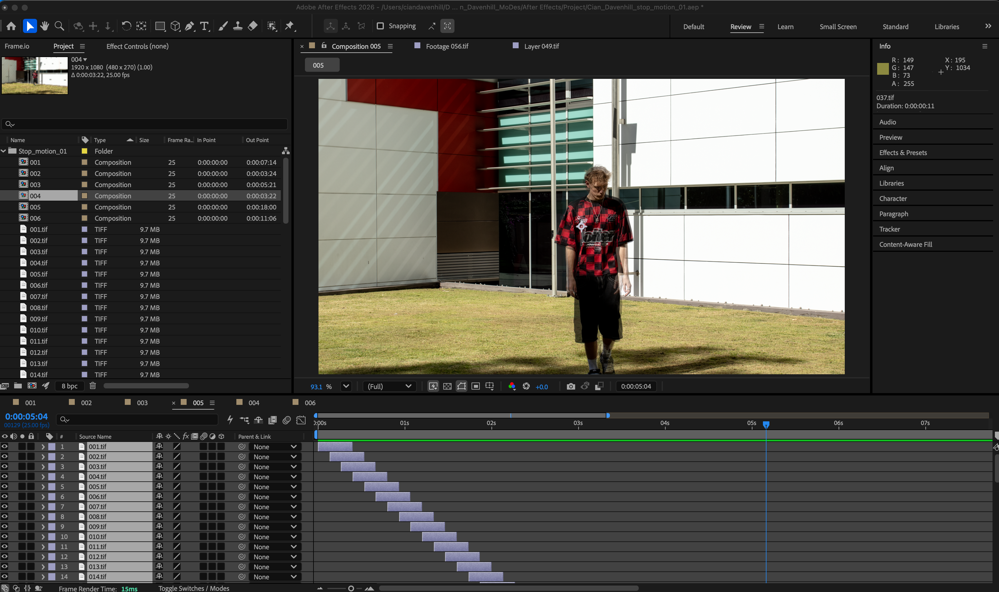
*Timeline panel showing the extended overlap and Cross Dissolve transition for Composition 5.*

<h3 class="composite-title">Composition 6 — Manual keyframe animation</h3>
<iframe width="560" height="315" src="https://www.youtube.com/embed/StoHVctIs_I" title="YouTube video player" frameborder="0" allowfullscreen></iframe>

*Rather than relying on the automated composition settings, this version was built by manually keyframing Scale and Position on individual layers within the Timeline — subtly zooming and shifting each still during its hold, producing a "living stills" drift rather than static frames. This demonstrates direct keyframe control beyond the New Composition from Selection dialog used in Compositions 1–5.*

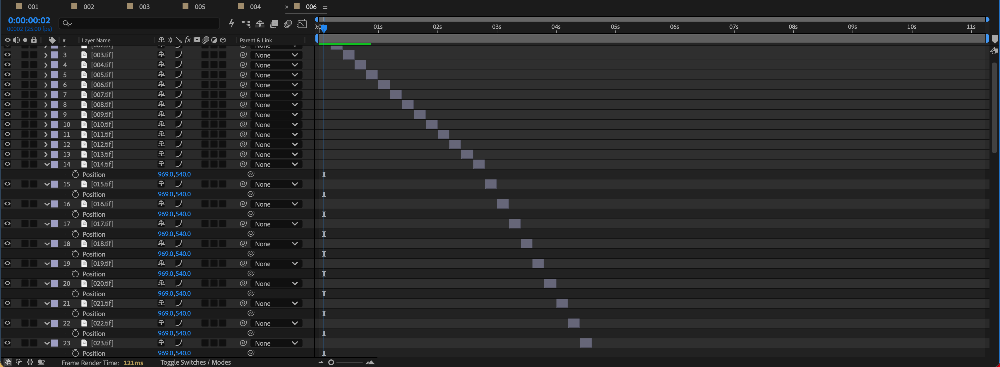
*Timeline panel showing manually placed Scale and Position keyframes for Composition 6.*

---

## Task 06: Reflective Report

Working through this assignment gave me a much clearer understanding of non-destructive editing as a genuine workflow, not just a checklist of Photoshop tools. Building four composites forced me to think about which technique actually suited each image rather than defaulting to one method — I learned that a gradient mask reads very differently to a hand-painted brush mask, and that clipped adjustment layers (like Curves) behave completely differently to unclipped ones sitting above a whole composite.

A genuine challenge came early: my Quick Selection masks kept producing harsh, obviously artificial edges that undermined the blend rather than supporting it. Rather than forcing the technique to work, I switched to gradient and brush masking for the composites where blending needed to look intentional, and used Quick Selection only where a precise edge was actually the goal. That decision — and troubleshooting smaller issues like a hidden layer blocking the Brush tool — taught me that technique choice depends on the image's tonal structure and intent, not just the desired outcome.

Task 04 reinforced the same layer thinking temporally: toggling masks, blend modes, and visibility between frames in the Timeline panel showed me how spatial edits (Task 03) and temporal edits (Task 04) are really the same skill applied on a different axis.

After Effects extended this further. Producing six compositions from one stop-motion sequence — varying still duration, overlap, and transition type, then pushing into manual Scale and Position keyframing — clarified how temporal rhythm is a deliberate design choice, not a default setting. Comparing a 2-frame still duration against a 12-frame overlap with Cross Dissolve made the emotional effect of pacing immediately obvious in a way reading about it never would have.

If I continued this project, I would explore Time Remapping and speed ramping more deliberately, since my current pacing control relies on discrete stills rather than true continuous motion manipulation. Overall, this assignment shifted my understanding of motion design from a set of separate tools toward a single continuum of spatial and temporal control.

---

## Assignment 02: Motion Graphic Design

<a href="#a02-task-01">Task 01</a> &nbsp;·&nbsp; <a href="#a02-task-02">Task 02</a> &nbsp;·&nbsp; <a href="#a02-task-03">Task 03</a> &nbsp;·&nbsp; <a href="#a02-task-04">Task 04</a>

For this assignment I developed a kinetic typography concept inspired by Junya Watanabe's poem and slogan garments — particularly the repeated, overlapping, multi-coloured phrase treatment seen across his archive pieces. Using the phrase *"Life itself is the immortal state of love, the supreme virtue of all virtues when acquired it is more important than"*, I built a layered, staggered text animation in 2D, then extended it into 3D space with depth, lighting, and camera movement.

<h3 class="composite-title">Exemplar Research</h3>
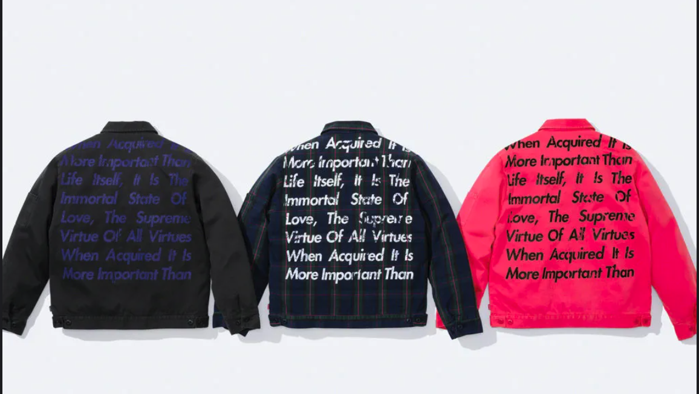
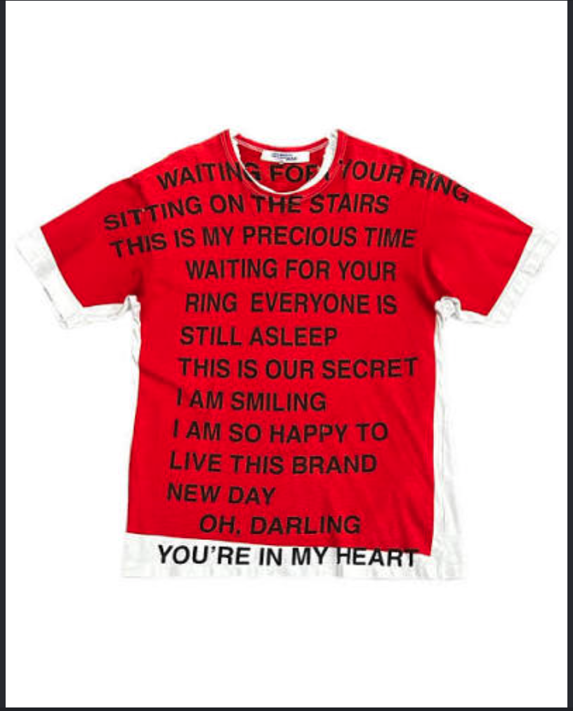
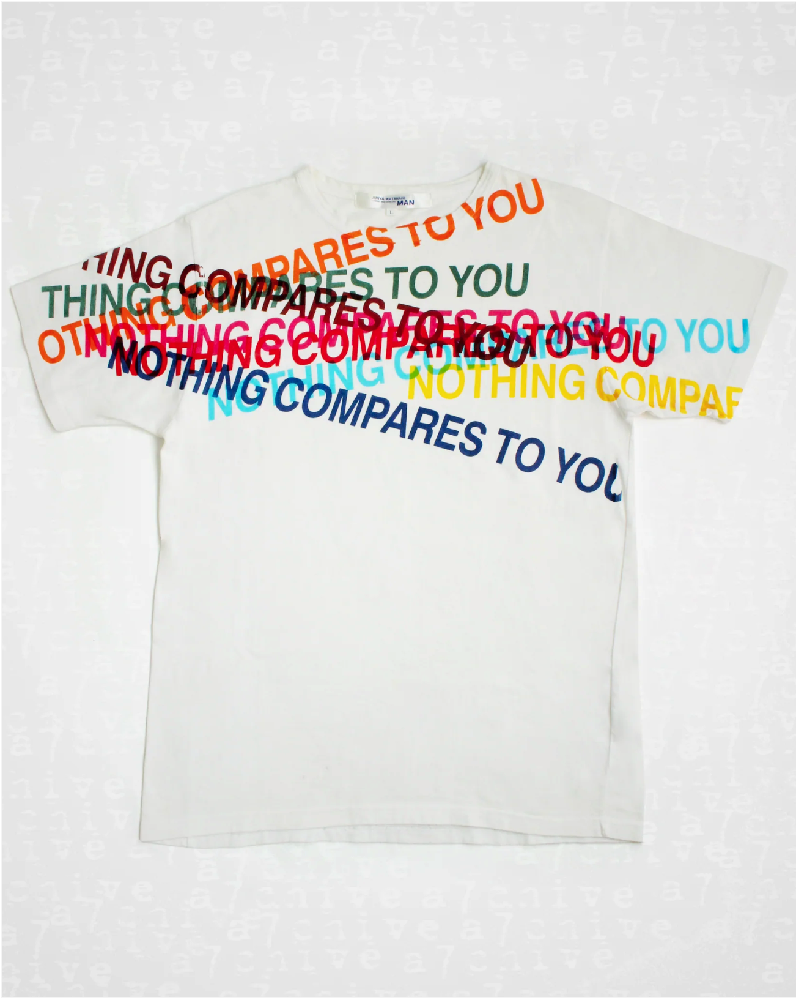
*Reference garments by Junya Watanabe — the layered, overlapping, multi-coloured repeated phrase treatment across the sleeve of the white t-shirt directly informed the staggered colour-duplicate technique used throughout Task 01 and 02.*

---

<h3 class="composite-title">Task 01: Animating 2D Text</h3>

Working from the Watanabe reference, I duplicated the phrase across multiple text layers, each in a different colour, with slight rotation and position offsets to recreate the layered, scattered effect from the garment. Entrances were staggered and synced to an audio track using waveform markers.

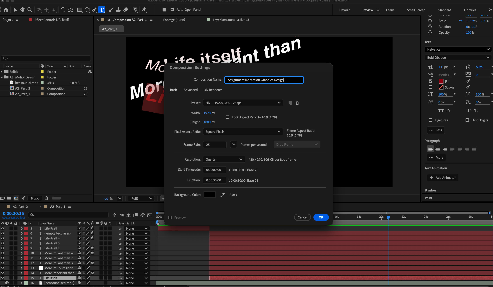
*HD composition set to 1920x1080 at 25fps.*

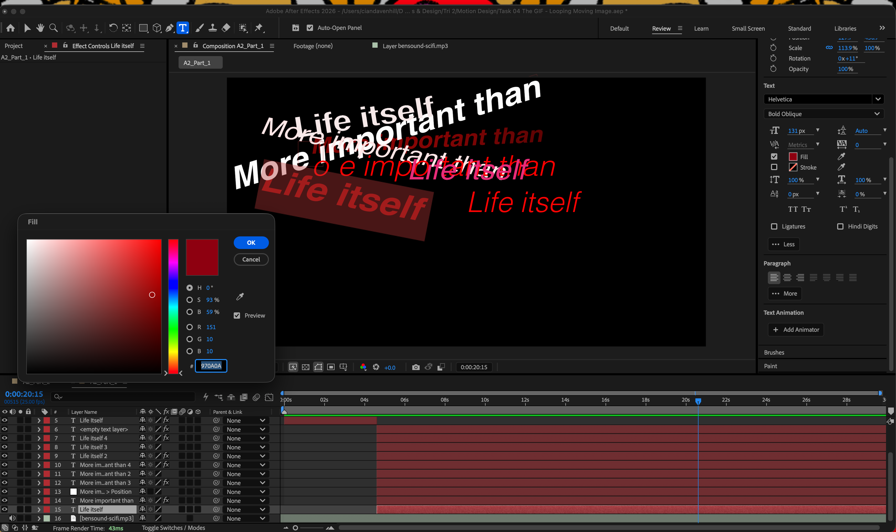
*Text panel showing font, colour, and kerning adjustments applied across the duplicated phrase layers.*

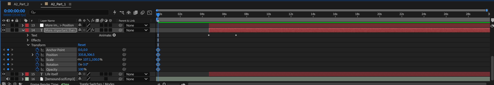
*Position, Rotation, and Scale keyframed individually on each staggered colour duplicate to build the layered, offset composition.*

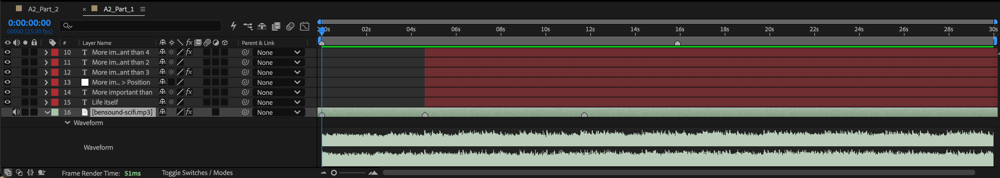
*Audio waveform with markers placed at key beats, used to cue each colour layer's entrance in sync with the track's rhythm.*

<video controls width="100%">
  <source src="A2_Part_1.mp4" type="video/mp4">
</video>
*Final Task 01 composition — layered, staggered 2D kinetic type synced to audio.*

---

<h3 class="composite-title">Task 02: Working with 3D Text</h3>

Building on the same phrase and colour-duplicate structure from Task 01, I extended the concept into 3D space — staggering the layers in genuine depth (Z-position) rather than just 2D offset, and adding a camera push-through move to reveal the layering spatially.

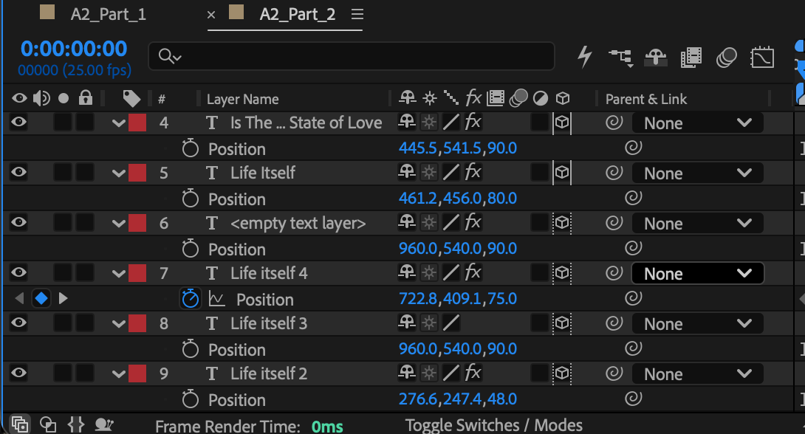
*Z-position keyframed across each colour layer to stagger them spatially, giving the overlapping phrases genuine depth rather than flat 2D offset.*

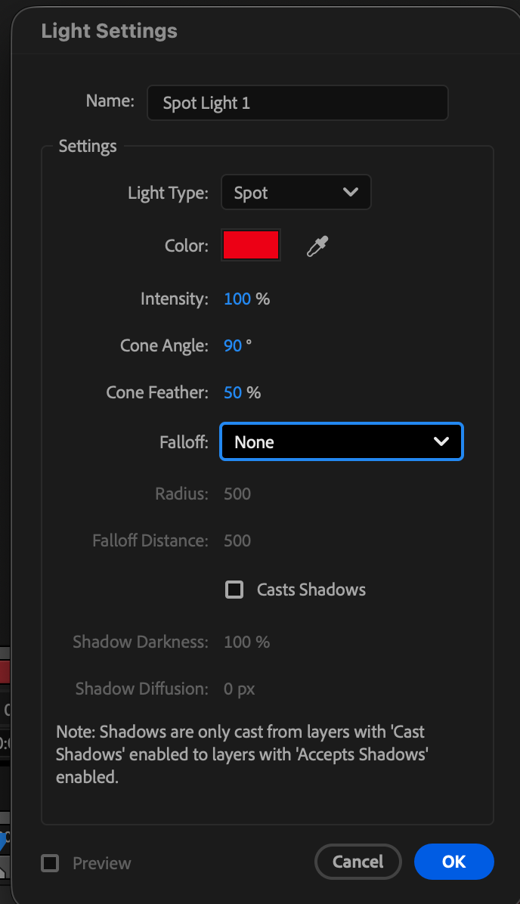
*Spotlight added and positioned to rake across the staggered 3D text, revealing the extrusion and bevel through highlight and shadow.*

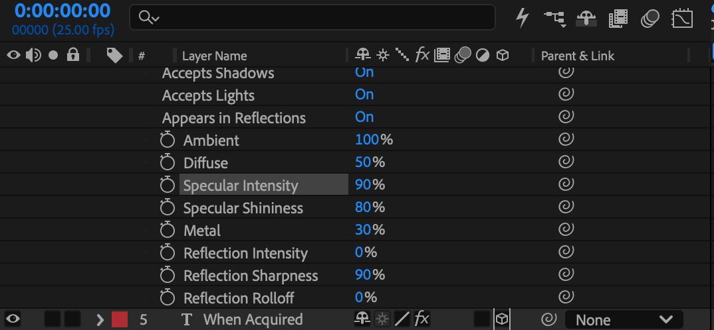
*Specular Intensity and Shininess adjusted per layer so light reflects differently across each colour duplicate.*

<video controls width="100%">
  <source src="A2_Part_2.mp4" type="video/mp4">
</video>
*Final Task 02 composition — 3D extruded, lit, and camera-animated version of the layered text concept.*

---

<h3 class="composite-title">Task 03: Refining, Timing, and Compositing</h3>

Task 01 and Task 02 were combined into a single sequenced composite, cross-fading from the 2D layered version into the 3D extruded version. During this process I encountered a frame rate mismatch between the two source compositions, which caused the audio and animation to desynchronise and slow noticeably midway through the sequence — resolved by rebuilding the composite from my rendered exports rather than nested live compositions.

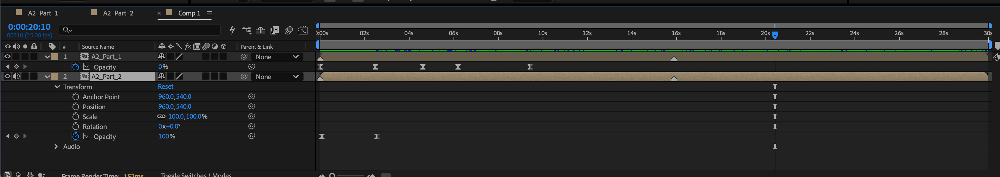
*Task 01 and Task 02 sequenced together in a new composite, with a cross-fade transition between them.*

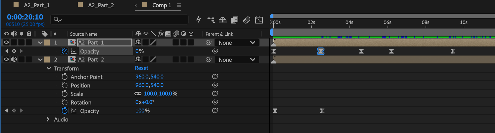
*Opacity keyframes used to create the cross-fade transition between the two sequences, synchronised against the shared audio track.*

<video controls width="100%">
  <source src="Comp 1.mp4" type="video/mp4">
</video>
*Final refined Task 03 composite — combining the 2D and 3D kinetic text sequences into one finished, synchronised motion design piece.*

---

<h3 class="composite-title">Audio Attribution</h3>

*Licence terms for the royalty-free track used throughout Assignment 02, used under a free licence with attribution.*

---

<h3 class="composite-title">Task 04: Reflective Report</h3>

This assignment extended my kinetic typography practice into layered, spatial composition, using Junya Watanabe's overlapping poem and slogan garments as my exemplar — particularly the repeated, multi-coloured phrase treatment across his archive pieces. I chose the line "Life itself is the immortal state of love, the supreme virtue of all virtues when acquired it is more important than" for its cyclical structure, which suited a staggered, layered reveal rather than a single linear read.

In Task 01, I duplicated the phrase across multiple text layers, varying colour, rotation, and position to recreate Watanabe's scattered overlap, then staggered each layer's entrance using markers placed against the audio waveform. Task 02 extended this into three dimensions: rather than treating depth as decorative, I staggered each colour layer's Z-position individually, so the "layering" implied by the 2D overlap became a literal spatial structure. Animating the camera to push through this stack, combined with a Spotlight raking across the extruded bevels, let me test how virtual lighting and camera movement can make a flat design reference feel genuinely three-dimensional.

A significant technical challenge was a frame rate mismatch between my Task 01 and Task 02 compositions, which caused audio and animation to desynchronise and slow midway through my combined Task 03 sequence. Diagnosing this — checking each composition's frame rate individually rather than assuming they matched — taught me that compositing isn't just arranging finished pieces, but verifying their underlying technical parameters align. I resolved it by rebuilding the sequence from my rendered exports rather than nested live compositions.

Researching the neon flicker wiggle-expression technique for my glow effects was similarly self-directed, beyond what the task sheets covered, and reinforced how expressions can generate more convincing, less mechanical randomness than manual keyframing alone.

If I extended this project, I would explore more deliberate colour sequencing across the layers, since my current palette choices were closer to instinctive than systematic, and I'd like to test whether syncing extrusion depth itself to the audio's rhythm could reinforce the spatial concept further.

---

## Assignment 03: Soundtrack Design

<a href="#a03-genre">Genre & Exemplars</a> &nbsp;·&nbsp; <a href="#a03-tools">Tools & Materials</a> &nbsp;·&nbsp; <a href="#a03-progress-1">Progress 1: Premiere Pro</a> &nbsp;·&nbsp; <a href="#a03-mix">Final Mix: Audition</a> &nbsp;·&nbsp; <a href="#a03-final">Final Outcome</a> &nbsp;·&nbsp; <a href="#a03-credits">Credits</a> &nbsp;·&nbsp; <a href="#a03-reflection">Reflective Report</a>

For Assignment 03 I designed a multi-layered soundtrack for my Assignment 02 kinetic typography piece. Because the motion design is built entirely from type, with no physical action on screen, there was nothing literal to record Foley for. Instead, I extended my Junya Watanabe concept into sound: scissors, sewing machine, fabric and zipper Foley present the phrase as something being cut, stitched and constructed, the way Watanabe builds garments out of text. These sit alongside the sci-fi house track carried over from A2, an ambience bed, and cinematic sound effects that mark the key moments of the 2D-to-3D transition.

---

<h3 class="composite-title">Genre & Exemplars</h3>

The piece sits within the genre of **title design**: short typographic motion sequences where the soundtrack carries as much of the tone and rhythm as the image.

**Kyle Cooper, *Se7en* title sequence (1995).** Cooper's opening titles pair scratched, jittering, hand-made type with a dense, textural soundtrack built around a remix of Nine Inch Nails' "Closer". The sound is tactile and mechanical, so the type feels physically made rather than digitally placed. I borrowed this idea of texture-led sound tied directly to typographic movement, but adapted it to a cleaner, beat-driven sci-fi aesthetic to suit my A2 visuals.

**Michel Chion, *Audio-Vision: Sound on Screen* (1994).** Chion's concept of *synchresis*, the spontaneous bond the brain forms between a sound and an image that occur at the same instant, underpins my approach. None of my Foley is literally caused by what is on screen, but by syncing each snip and stitch to a frame-accurate type entrance, the sound reads as if it belongs to the text itself.

**Walter Murch, *Apocalypse Now* (1979).** Murch was the first person credited as a "sound designer" on a feature film. His practice of building a soundtrack in deliberate layers, each with its own job, informed how I separated music, ambience, Foley and effects onto their own tracks so each could be balanced independently.

---

<h3 class="composite-title">Tools, Media & Third-Party Materials</h3>

**Tools:** Adobe Premiere Pro 2026 for layout and sync, Adobe Audition 2026 (via Dynamic Link) for mixing, the Essential Sound panel, Effects Rack, Studio Reverb, Parametric Equalizer and Hard Limiter.

**Media:** my rendered A2 kinetic typography sequence (1920x1080, 25fps), one music track, ambience beds, Foley and sound effects.

**Third-party materials:** all sounds are royalty-free assets from Pixabay plus the Bensound track used in A2. I used third-party sound because a typographic piece has no physical action to record, and because sourcing let me focus on design decisions: how sounds are cut, timed, layered and processed. Rather than re-using them as-is, each asset was adapted: trimmed to its transient, re-timed to individual type entrances, re-levelled, filtered and processed with reverb, so the scissors and sewing machine stop being "household sounds" and become the rhythmic language of the type.

*Searching Pixabay's royalty-free library. I auditioned several options for each category and chose sounds with short, clean transients that could be synced precisely to type entrances.*

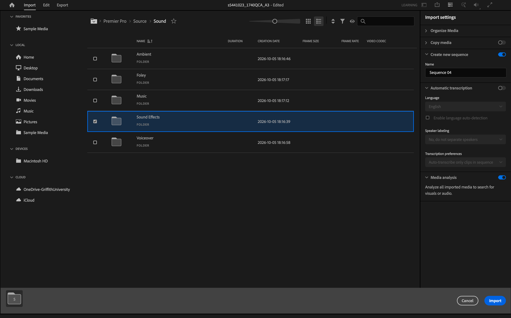
*Importing sounds from my organised Sound folder (Ambient, Foley, Music, Sound Effects, Voiceover), continuing the folder structure from Assignment 01. Premiere's Import screen has "Create new sequence" switched on by default, which kept splitting my sounds into new sequences until I turned it off.*

---

<h3 class="composite-title">Progress 1: Layout and Sync in Premiere Pro</h3>

The first pass established the structure of the soundtrack: every sound on its own track, trimmed and placed against the moments in the A2 animation, with the original A2 audio muted so the soundtrack could be rebuilt from scratch.

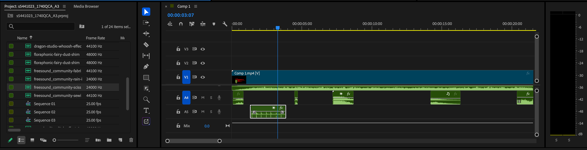
*Track layout in Premiere Pro: the A2 render on V1, with music, ambience, Foley and sound effects layered on separate audio tracks. Separating them meant each layer could later be tagged, ducked and processed independently.*

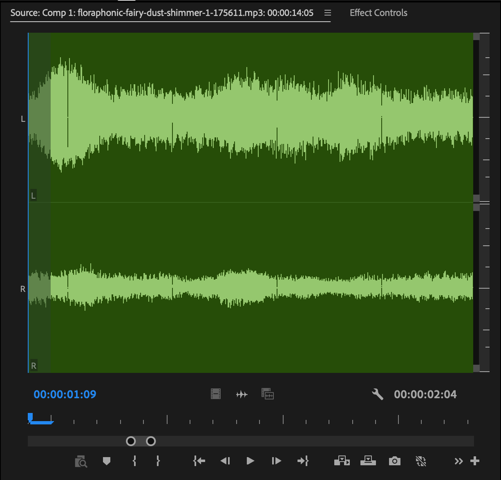
*Trimming the fairy-dust shimmer in the Source Monitor with In and Out points, keeping only the bright attack so it lands on the spotlight sweep instead of trailing over the next cut.*

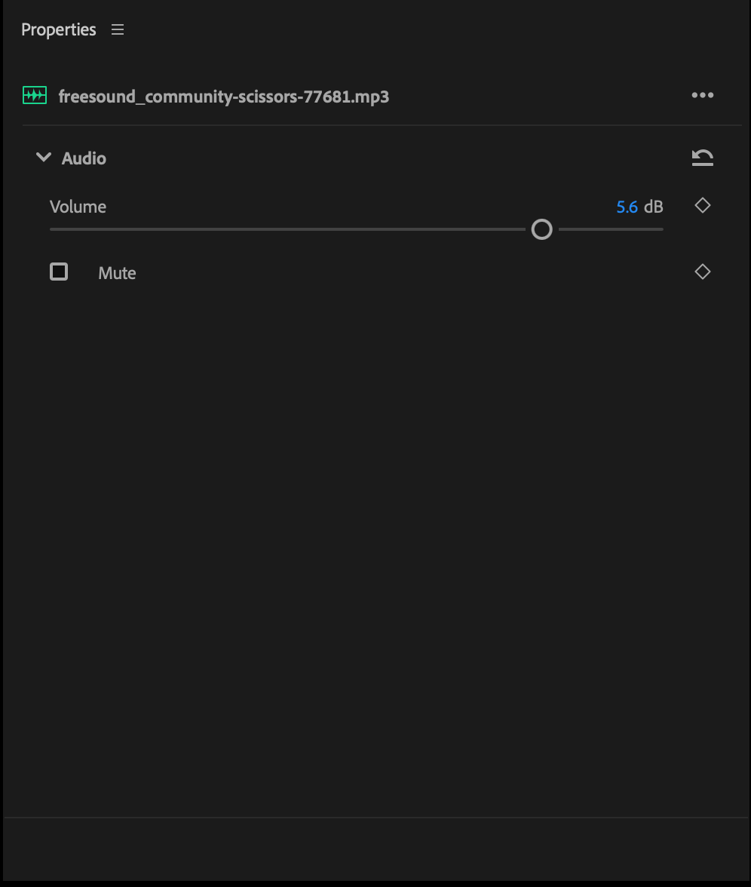
*Clip volume on the scissors raised by +5.6 dB. The snips are quiet, high-frequency sounds, and at their original level they disappeared under the music.*

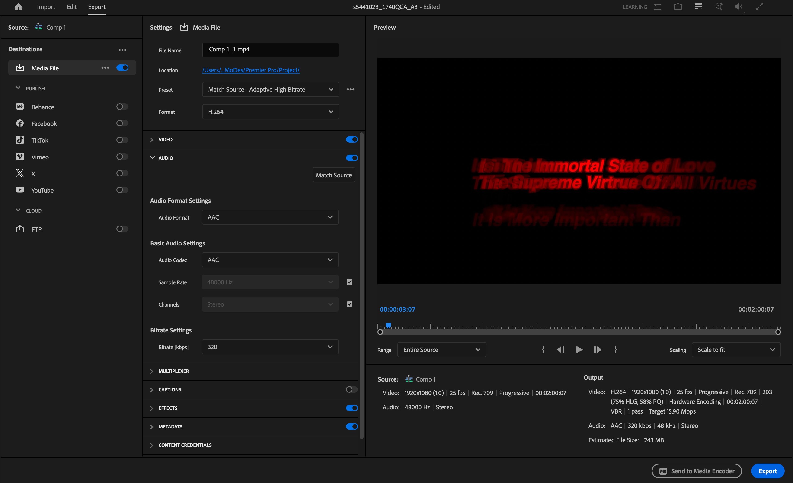
*Export settings: H.264, 1920x1080 at 25fps to match the A2 source, with AAC audio at 48 kHz and 320 kbps so the mix isn't degraded by compression.*

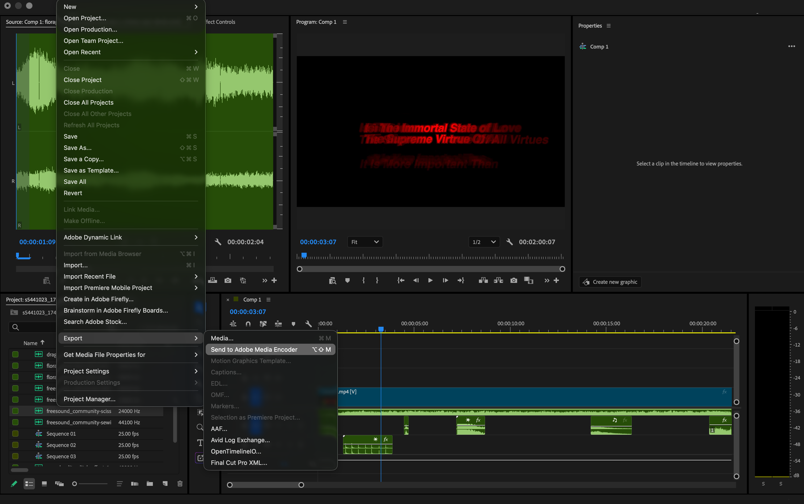
*Exporting Progress 1 from Premiere Pro (File > Export) as a checkpoint before moving the mix into Audition.*

<iframe width="560" height="315" src="https://www.youtube.com/embed/eGvyQZbpWXU" title="YouTube video player" frameborder="0" allowfullscreen></iframe>

*Progress 1: all layers in place and synced. Playing it back showed the sync worked but the mix didn't: the music masked the scissors and stitches, and the room tone added a low, muddy rumble under everything. These became the problems to solve in Audition.*

---

<h3 class="composite-title">Final Mix: Refining in Adobe Audition</h3>

The sequence was sent to Audition through Dynamic Link (Edit > Edit in Adobe Audition > Sequence), which opened a multitrack session with the video preview locked in sync with the audio.

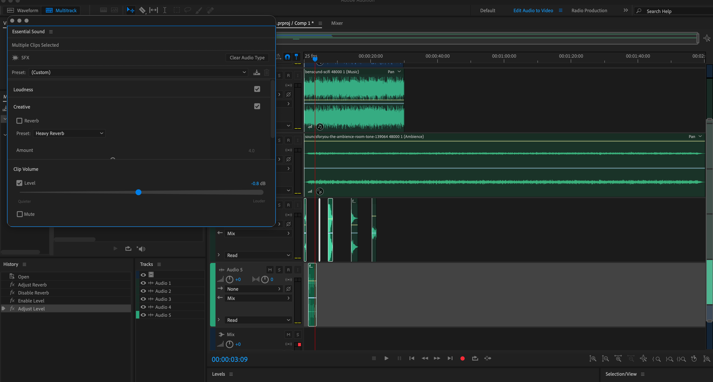
*All Foley and sound effect clips selected together and tagged as SFX in the Essential Sound panel, with Loudness enabled to even out their levels. I also tested Essential Sound's Heavy Reverb across all the SFX, then disabled it (see the History panel): it blurred the snips and stitches that needed to stay crisp.*

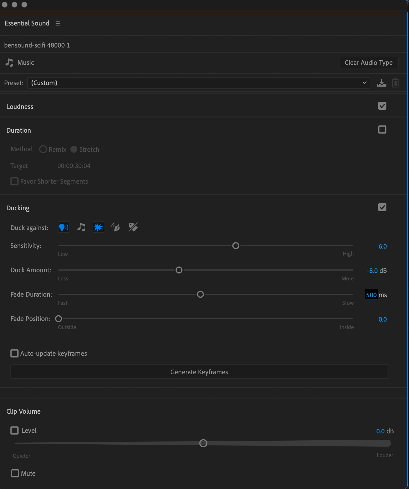
*Ducking on the Bensound track: duck against SFX, sensitivity 6.0, duck amount −8 dB, 500 ms fades. The music now dips automatically under each sound effect, so every snip and stitch reads clearly, then swells back between them.*

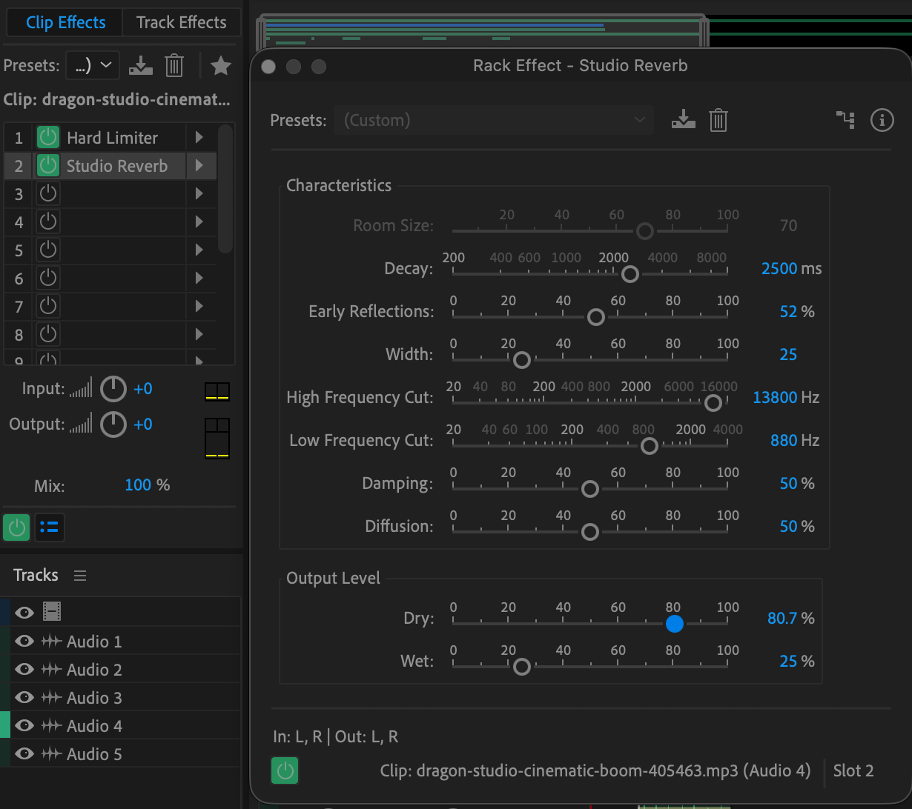
*Clip effects on the cinematic boom: a Hard Limiter to stop the peak clipping, then Studio Reverb (2500 ms decay, 25% wet). The Low Frequency Cut is set to 880 Hz so only the upper part of the boom gets reverb. The 3D reveal sounds large without the low end turning muddy.*

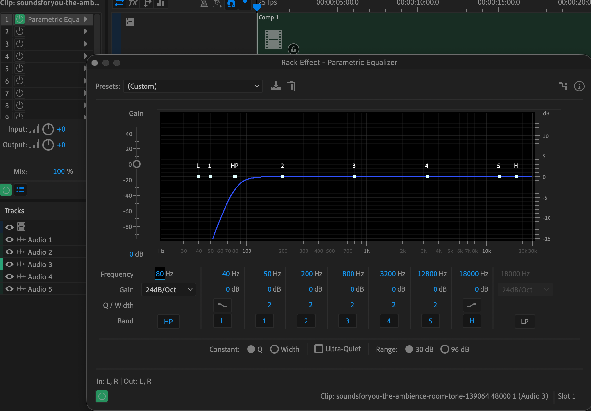
*Parametric Equalizer on the room tone: a high-pass filter at 80 Hz (24 dB/octave) removes the low rumble heard in Progress 1, keeping the ambience as air and texture rather than mud.*

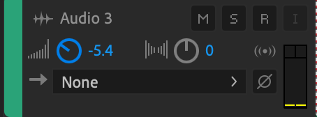
*Room tone track lowered to −5.4 dB at track level, so the ambience sits just beneath conscious attention: present enough to stop the silence feeling empty, quiet enough not to compete with the Foley.*

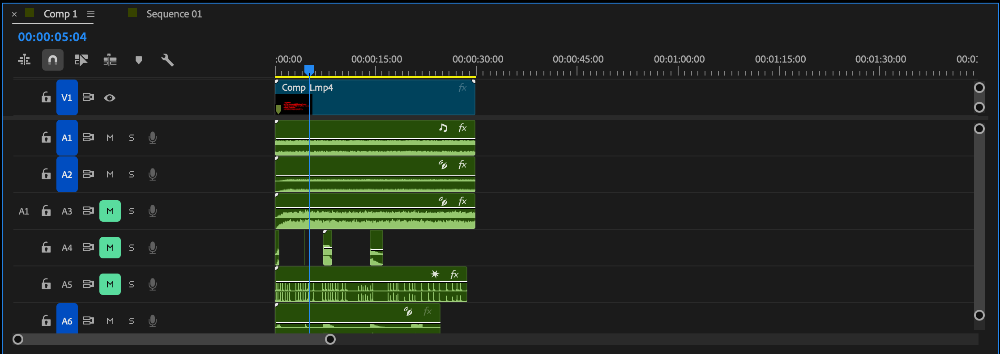
*The finished Audition mix exported back into Premiere Pro (Multitrack > Export to Adobe Premiere Pro), with the original working tracks muted so only the final mix plays against the picture.*

---

<h3 class="composite-title">Final Outcome</h3>

<iframe width="560" height="315" src="https://www.youtube.com/embed/Y4XnAT3Kfp8" title="YouTube video player" frameborder="0" allowfullscreen></iframe>

*Final soundtrack: music, ambience, Foley and sound effects layered and synced to the A2 kinetic typography, with ducking, EQ, reverb and limiting applied in Audition. Compared to Progress 1, the Foley now cuts through the music, the low end is cleaner, and the riser and boom give the 2D-to-3D transition a clear sense of build and release.*

---

<h3 class="composite-title">Audio Credits</h3>

All sound effects and ambience were sourced from Pixabay under the Pixabay Content License (free to use and modify, no attribution required; credited here anyway). Music: "Sci-Fi" by Bensound (bensound.com), used under Bensound's free licence with attribution, as in Assignment 02.

*"Swoosh Riser Reverb" by DRAGON-STUDIO. Riser into the 2D-to-3D transition.*

*"Whoosh Effect" by DRAGON-STUDIO. Camera push-through.*

*"Cinematic Boom" by DRAGON-STUDIO. Impact as the 3D text lands.*

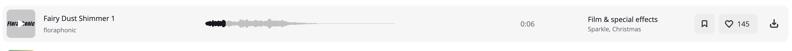
*"Fairy Dust Shimmer 1" by floraphonic. Spotlight sweep.*

*"Glitch Effect 6" by SoundReality. Fast, jittering type moments.*

*"scissors" by freesound_community. Foley for colour-layer entrances.*

*"Sewing Machine" by freesound_community. Foley for text building across the frame.*

*"fabric rustling foley" by freesound_community. Foley for rotations and soft movement.*

*"zipper sound" by u_k6drbrhips. Foley used to open the sequence.*

*"The Ambience Room Tone" by SoundsForYou. Main ambience bed.*

*"Rain in the city" by freesound_community. Secondary ambience layer.*

*"Minimal - Minimal Ambient Background" by AudioDollar. Contrasting music track auditioned against the Bensound track.*

---

<h3 class="composite-title">Reflective Report</h3>

Assignment 03 shifted my focus from how motion looks to how it sounds, and showed me how much a soundtrack decides how motion is read. Because my A2 piece is kinetic typography with no physical action on screen, there was nothing literal to record Foley for. Rather than treating that as a limitation, I used it to extend my Junya Watanabe concept: scissors snips, sewing-machine bursts, fabric rustles and a zipper present the text as something cut, stitched and constructed, the way Watanabe constructs garments. These sounds are technically non-diegetic, but synced tightly enough they read as if they belong to the type itself, which is what Michel Chion (1994) calls synchresis: the bond the brain forms between a sound and an image that happen at the same moment.

Kyle Cooper's *Se7en* title sequence (1995) was my main exemplar. Its scratchy, layered soundtrack makes jittery, hand-made type feel physical and uneasy. I borrowed the idea of texture-driven sound tied to typographic movement, while keeping a cleaner, more rhythmic feel to match the Bensound sci-fi house track carried over from A2. Following Walter Murch's layered approach, I kept music, ambience, Foley and effects on separate tracks so each could be balanced on its own terms.

Progress 1 established the structure in Premiere Pro: each sound trimmed to its transient and placed against the A2 animation. Playing it back proved the sync worked but the mix didn't. The music masked the snips, and the room tone added a low muddiness. The final mix in Audition addressed both. Essential Sound ducking (−8 dB, 500 ms fades) lets the music dip under each effect. A high-pass filter at 80 Hz removed the rumble from the room tone. Studio Reverb on the cinematic boom, with a low-frequency cut at 880 Hz and a hard limiter to prevent clipping, gave the 3D reveal scale without washing out its low end. I also tested Essential Sound's reverb across all the SFX and disabled it, because it blurred the transients that needed to stay crisp.

The biggest technical lesson was that audio levels are relational. Raising the scissors by +5.6 dB only worked once the room tone was pulled back to −5.4 dB at track level; every adjustment changed how every other layer was heard. Much of the troubleshooting was self-directed. Premiere's Import screen kept creating a new sequence for every batch of sounds until I found the "Create new sequence" toggle. Edit in Adobe Audition didn't work at first, and I had to work out how Dynamic Link connects the two apps. My Pixabay files also arrived at mixed sample rates (24, 44.1 and 48 kHz), which had to conform to the 48 kHz sequence. Adobe's Audition tutorials helped me with the multitrack session, Essential Sound and the Effects Rack, none of which I had used before this assignment.

If I extended this project, I would record my own Foley (real fabric, scissors and a sewing machine) to make the soundtrack fully original rather than adapted, and use Audition's Match Loudness to hit a measured loudness target rather than judging levels by meters alone. I would also pan the snips left and right to follow each colour layer's position on screen, so the stereo field reinforces the spatial layering established in A2.
